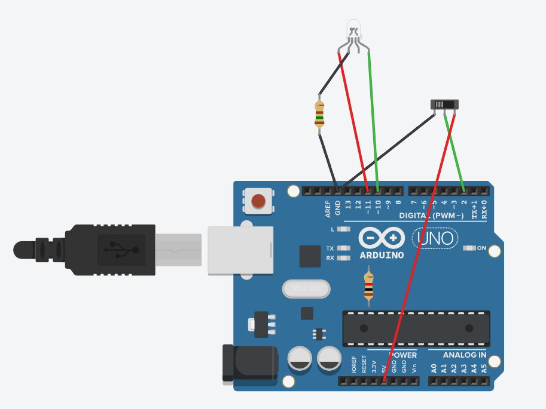
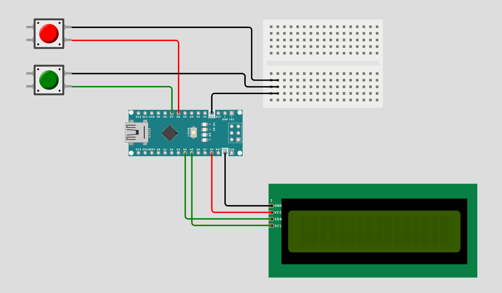
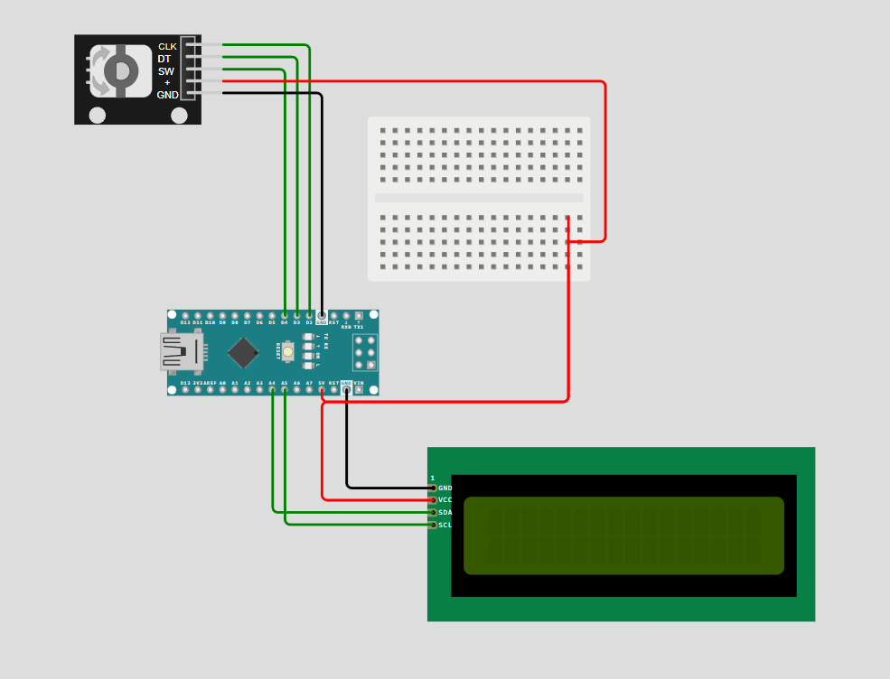
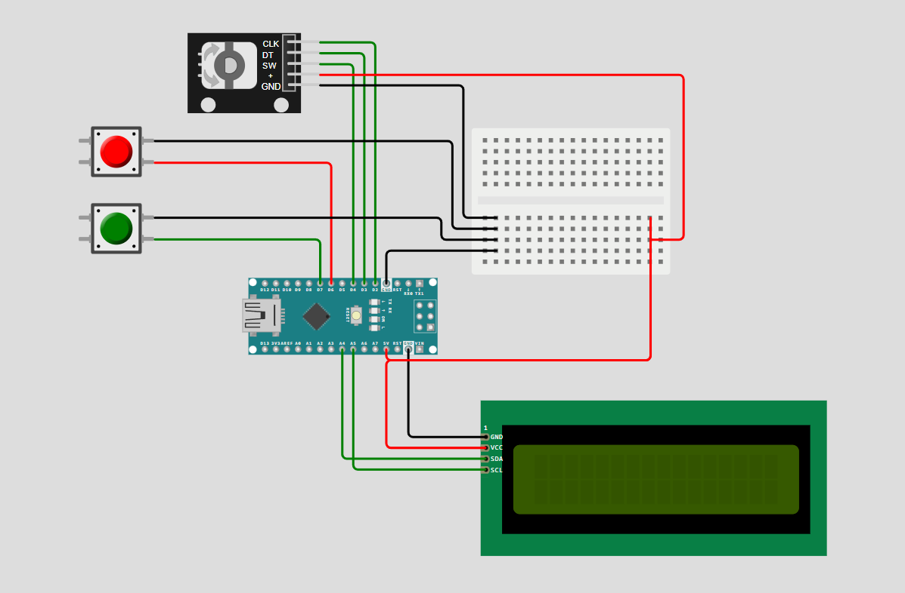
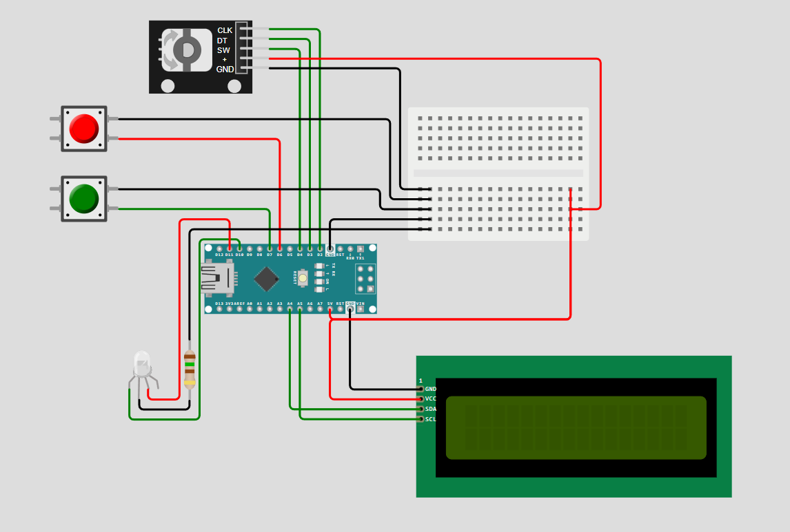
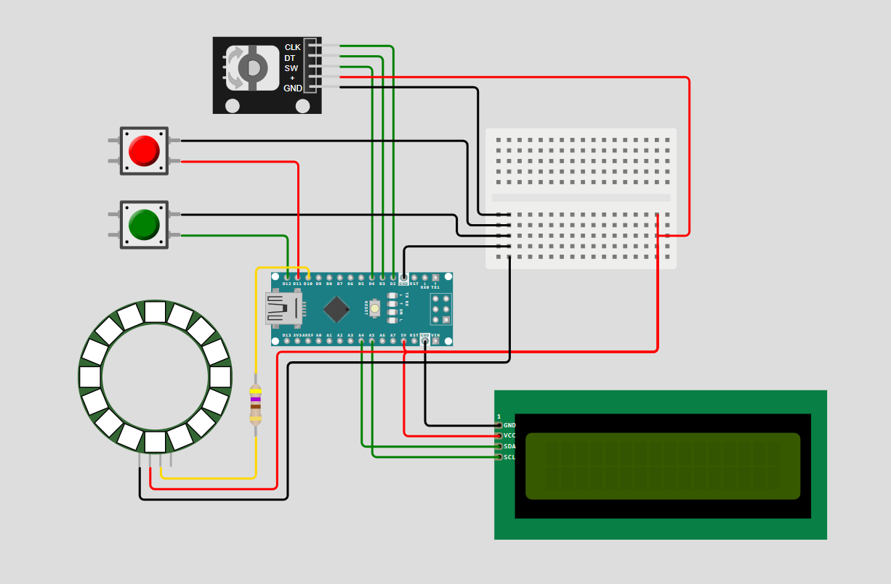

# Arduino Flowguard
## Introductie
Volgens cijfers van het RIZIV is meer dan een derde van de langdurige arbeidsongeschiktheid in België gelinkt aan psychische stoornissen, met depressie en burn-out als koplopers. Een belangrijke oorzaak hiervan is de aanhoudende werkdruk, stress en het gebrek aan pauzes — zeker bij mensen die aan een bureau werken in een kantooromgeving. Dit project is ontstaan als antwoord op die problematiek.

## Doel
De Flowguard helpt kantoormedewerkers door:  
- Regelmatig pauzes aan te moedigen  
- Visueel de werkstatus te tonen aan collega’s  
- Een gevoel van controle en voldoening te geven over het werkritme

Deze synthese beschrijft het ontwerp van het Arduino-circuit en de bijbehorende code die dit product functioneel maken.
## Materiaal
- **Arduino Nano:**  
  Arduino werd gekozen vanwege de eenvoud om ermee te werken en de compabiliteit met andere onderdelen. De Nano biedt genoeg pinnen aan om mee te werken en is de compactste microcontroller ter beschikking. Dit is belangrijk om het geheel in ons compact prototype te doen passen.

- **RGB LCD-scherm:**  
  Het scherm kan de resterende tijd duidelijk weergeven op een intuïtieve en welbekende manier (HH:MM:SS). De RGB optie biedt de mogelijkheid om de achtergrondkleur te veranderen van kleur, afhankelijk van de status (groen of rood). Het scherm geeft hierdoor duidelijke feedback op de handelingen die de gebruiker uitvoert voor zowel de timer als de status-update. Er kan met de lichtsterkte en flikkersnelheid van de RGB backlight gespeeld worden om bepaalde boodschappen en statussen van het product over te brengen.

- **Rotary Encoder:**  
  De encoder laat toe om op een natuurlijke manier tijd in te stellen met de draaifunctie en de timer te starten/stoppen met de indrukfunctie. Met deze enkele knop kunnen er twee handelingen zeer intuïtief uitgevoerd worden. Dit draagt bij aan de simpliciteit en strak voorkomen van het prototype.

- **LED Arcade drukknoppen:**  
  Twee fysieke knoppen om de kleuren groen en rood in te schakelen zijn goed zichtbaar en hebben een goede sensitiviteit. Bij het indrukken keren de knoppen direct terug naar de originele positie, wat het mogelijk maakt om de status van kleuren te veranderen los van het indrukken zonder de knoppen fysiek van positie te moeten veranderen.

- **Adafruit NeoPixel RGB-ledring:**  
  De ledring geeft visuele feedback aan andere collega's op afstand. Het kleur update naargelang de knoppen ingedrukt worden of wanneer een bepaalde tijdsduur is overschreden en loopt synchroon met de RGB backlight van het scherm. Er werd voor de ring gekozen, aangezien het design voor de lamp ook cirkelvormig is en de ring meer en verdeelder licht biedt dan een enkele RGB led.

## Functies
### Groen/Rood lamp
**Aan te pakken probleem:**  
In kantoren is het vaak onduidelijk of iemand geconcentreerd aan het werk is of openstaat voor onderbrekingen. Hierdoor ontstaan onnodige verstoringen die stress kunnen verhogen.  

**Oplossing:**  
Met twee fysieke knoppen (groen en rood) kan de gebruiker zelf de werkstatus aangeven.  
- Bij een druk op **de groene knop** kleuren de RGB-backlight en de RGB-ledring groen.  
Dit geeft aan: "Ik ben beschikbaar" of "Ik werk in een normaal tempo".  
- Bij een druk op **de rode knop** kleuren de RGB-backlight en de RGB-ledring rood.  
Dit geeft aan: "Niet storen" of "Ik ben gefocust bezig".

Dit visueel systeem bevordert respect voor elkaars werkflow en voorkomt overbodige stressvolle onderbrekingen.  

### Timer
**Aan te pakken probleem:**   
Veel werknemers nemen te weinig pauzes, wat leidt tot mentale vermoeidheid. Pauzes zijn essentieel voor concentratie en stressverlaging, maar worden vaak vergeten of uitgesteld.  

**Oplossing:**  
Een visuele timer helpt bij brengen van structuur in een werkdag en het plannen van werkblokken en pauzes:  
- Door het **draaien** aan de rotary encoder kan tijd toegevoegd (met de klok mee) of afgetrokken (tegen de klok in) worden van de timer.
- Door het **drukken** op de rotary encoder kan de tijd gestart of stopgezet worden.  

Tijdens het aftellen van de timer is de RGB-ledring actief, wat naast de werkstatus van de gebruiker dus ook meedeelt dat die persoon aanwezig is op het bureau en aan het werk. Als de timer gepauzeerd is of de timer afgelopen is, staat de ledring uit.  

## Proces
### 1. [RGB-led met schakelaar](groenrood/RGB_led_schakelaar/RGB_led_schakelaar.ino)  

<details>
<summary>Code bekijken</summary>

```cpp
const int switchPin = 2;  // pin schakelaar
const int redPin = 11;    // pin rood
const int greenPin = 10;  // pin groen

void setup() {
    pinMode(switchPin, INPUT_PULLUP);
    pinMode(redPin, OUTPUT);
    pinMode(greenPin, OUTPUT);
}

void loop() {
    int switchState = digitalRead(switchPin); // waarde schakelaar inlezen

    if (switchState == LOW) {
        digitalWrite(redPin, LOW);
        digitalWrite(greenPin, HIGH);
    } else {
        digitalWrite(redPin, HIGH);
        digitalWrite(greenPin, LOW);
    }
}
```
</details>  

**Inhoud:**  
- RGB-led kleurt groen of rood naargelang de stand van de schakelaar
- RGB-led staat standaard op groen

**Leerpunten:**  
- RGB-led aansluiten op een Arduino
- RGB-led besturen met een schakelaar

### 2. [RGB-backlight met twee drukknoppen](groenrood/RGB_backlight_2drukknoppen/RGB_backlight_2drukknoppen.ino)  

<details>
<summary>Code bekijken</summary>

```cpp
#include <Wire.h>
#include "rgb_lcd.h"

rgb_lcd lcd;

const int buttonGreen = 6; // groene knop
const int buttonRed  = 7; // rode knop

const unsigned int LIGHT_SOFT = 25; // zachte lichtsterkte
const unsigned int LIGHT_BRIGHT = 140; // felle lichtsterkte

void setup() {
  lcd.begin(16, 2); // lcd scherm opstarten
  lcd.setRGB(0, LIGHT_SOFT, 0); // backlight standaard op groen

  // Knoppen als input met pull-up
  pinMode(buttonGreen, INPUT_PULLUP);
  pinMode(buttonRed, INPUT_PULLUP);
}

void loop() {
  // Als knop 1 ingedrukt is, zet backlight groen
  if (digitalRead(buttonGreen) == LOW) {
    lcd.setRGB(0, LIGHT_SOFT, 0); // Groen
  }

  // Als knop 2 ingedrukt is, zet backlight rood
  if (digitalRead(buttonRed) == LOW) {
    lcd.setRGB(LIGHT_SOFT, 0, 0); // Rood
  }
}
```
</details>  

**Inhoud:**  
- RGB-backlight kleurt groen of rood naargelang de groene of rode knop ingedrukt is
- RGB-backlight staat standaard op groen

**Leerpunten:**  
- RGB lcd scherm aansluiten op een Arduino
- Library gebruiken om RGB lcd scherm te besturen
- RGB-backlight besturen met twee drukknoppen

### 3. [Timer zonder RGB backlight](timer/timer_zonder_RGB_backlight/timer_zonder_RGB_backlight.ino)  

<details>
<summary>Code bekijken</summary>

```cpp
// libraries
#include <Wire.h> // indirect gebruikt via rgb_ldc
#include "rgb_lcd.h" // aansturen van rbd lcd scherm
#include <Encoder.h> // aansturen van rotary encoder

// pinnen
const int CLK = 2; // clock pin rotary encoder
const int DT = 3; // data pin rotary encoder
const int SW = 4; // switch pin rotary encoder

// naamgeving hardware
rgb_lcd lcd; // rgb lcd scherm benoemen
Encoder RotEnc(CLK, DT); // rotary encoder benoemen

// statussen timer
volatile unsigned long totalSeconds = 0; // totaal aantal seconden
unsigned long lastInteractionTime = 0; // tijdstip van laatste interactie met encoder of switch
long lastEncPos = 0; // positie van laatste encoder-lezing
bool timerRunning = false; // timer staat stil
bool timerFinished = false; // timer is niet afgelopen
bool BacklightOn = false; // backlight staat uit

// constanten
const unsigned int LIGHT_SOFT = 25; // zachte lichtsterkte
const unsigned int LIGHT_BRIGHT = 140; // felle lichtsterkte
const unsigned int BLINK_SPEED = 530; // flikkersnelheid in ms
const unsigned long BACKLIGHT_DELAY = 7000; // tijd dat RGB aanblijft in ms, moet long zijn want moet compatibel zijn met millis()

void setup() {
  pinMode(SW, INPUT_PULLUP); // drukknop activeren
  lcd.begin(16, 2); // lcd tekst activeren
  displayTime(totalSeconds); // lcd tijd weergeven
  lcd.setRGB(0, LIGHT_SOFT, 0); // rgb backlight op zacht groen
  lastEncPos = RotEnc.read(); // stand encoder lezen
}

void loop() {
  Encoder(); // encoder inlezen en tijd verhogen of verlagen
  Switch(); // switch inlezen en tijd starten of stoppen
  Timer(); // tijd laten aflopen per seconde en stoppen bij 0
  Blink(); // flikkeren van de tijd en backlight wanneer nodig
  BacklightOff(); // vanzelf uitzetten backlight na bepaalde delay
  delay(5);
}

void Encoder() {
  long newEncPos = RotEnc.read() / 4;
  long diff = lastEncPos - newEncPos;

  if (diff != 0) { // werkt enkel als er gedraaid wordt
    if (!timerRunning) { // als timer stilstaat
      unsigned long step = getStepSize(); // stapgrootte wordt bepaald

      if (diff > 0) { // als naar rechts gedraaid wordt
        if (totalSeconds % step != 0) { // als de tijd geen veelvoud is van de stapgrootte
          totalSeconds = ((totalSeconds / step) + 1) * step; // eerst tijd naar boven afronden
        } else {
          totalSeconds += step; // anders gewoon stap bijtellen
        }

        if (totalSeconds > 359999) totalSeconds = 359999; // maximum van 99:59:59

      } else { // als naar links gedraaid wordt
        if (totalSeconds % step != 0) { // als de tijd geen veelvoud is van de stapgrootte
          totalSeconds = (totalSeconds / step) * step; // eerst tijd naar onder afronden
        } else {
          if (totalSeconds >= step) {
            totalSeconds -= step; // anders gewoon stap aftrekken
          } else {
            totalSeconds = 0; // minimum van 00:00:00
          }
        }
      }

      displayTime(totalSeconds); // nieuwe tijd weergeven op lcd scherm
      lastInteractionTime = millis(); // laatste interactietijd updaten om backlight aan te houden
      lcd.setRGB(0, LIGHT_SOFT, 0); // rgb backlight op zacht groen (stilstaande tijd zichtbaar maken om in te stellen)
      BacklightOn = true; // backlight staat aan
      timerFinished = false; // indien tijd ingesteld nadat timer afgelopen was, bool updaten naar niet meer finished

    } else { // als timer loopt
      lastInteractionTime = millis(); // laatste interactietijd updaten om backlight vanzelf uit te schakelen
      if (!BacklightOn) { // als de backlight nog niet aanstond
        lcd.setRGB(0, LIGHT_SOFT, 0); // rgb backlight op zacht groen (lopende tijd kort zichtbaar maken bij draaien aan encoder)
        BacklightOn = true; // backlight staat aan
      }
    }
  }

  lastEncPos = newEncPos; // positie van laatste encoder-lezing updaten
}

void Switch() {
  static bool lastPress = HIGH; // laatste indrukking staat standaard op niet ingedrukt
  bool newPress = digitalRead(SW); // switch inlezen

  if (lastPress == HIGH && newPress == LOW) { // als knop ingedrukt wordt
    if (timerRunning) { // als timer loopt
      timerRunning = false; // timer staat stil
      lcd.setRGB(0, LIGHT_SOFT, 0); // rgb backlight op zacht groen
      BacklightOn = true; // backlight staat aan
    } else { // als timer stilstaat
      if (totalSeconds > 0) { // als tijd groter is dan 00:00:00
        timerRunning = true; // timer loopt
        lastInteractionTime = millis(); // laatste interactietijd updaten om backlight vanzelf uit te schakelen
      }
    }
  }
  lastPress = newPress; // indrukstatus updaten
}

void Timer() {
  static unsigned long lastTick = 0; // laatste tick is in het begin 0
  if (timerRunning && millis() - lastTick >= 1000) { // als er 1 seconde gepasseerd is
    lastTick = millis(); // laatste tick updaten
    if (totalSeconds > 0) { // als timer nog niet afgelopen is
      totalSeconds--; // 1 seconde aftrekken
      displayTime(totalSeconds); // nieuwe tijd weergeven op lcd scherm
    }
    if (totalSeconds == 0) { // als timer afgelopen is
      timerRunning = false; // timer staat stil
      timerFinished = true; // timer is afgelopen
      BacklightOn = true; // backlight staat aan
    }
  }
}

void Blink() {
  if (timerRunning && !timerFinished) { // als timer loopt en nog niet afgelopen is
    return; // niet flikkeren
  }

  static unsigned long lastBlink = 0; // laatste flikkerstatus is in het begin 0
  static bool visible = true; // tijd is zichtbaar op scherm

  if (millis() - lastBlink >= BLINK_SPEED) { // als flikkerinterval is overschreden
    lastBlink = millis(); // laatste flikkerstatus updaten
    visible = !visible; // tijd is niet zichtbaar op scherm

    if (visible) { // als tijd zichtbaar is op scherm
      displayTime(totalSeconds); // tijd weergeven op lcd scherm
      if (timerFinished) { // als tijd afgelopen is
        lcd.setRGB(0, LIGHT_BRIGHT, 0); // rgb backlight op fel groen
      }
    } else { // als tijd niet zichtbaar is op scherm
      lcd.setCursor(4, 1);
      lcd.print("        "); // lege tekst weergeven op lcd scherm
      if (timerFinished) { // als tijd afgelopen is
        lcd.setRGB(0, 0, 0); // rgb backlight uit
      }
    }
  }
}

void BacklightOff() {
  if (timerRunning && BacklightOn && millis() - lastInteractionTime >= BACKLIGHT_DELAY) { // als de tijd loopt en de backlight al voor een bepaalde tijd aanstaat
    lcd.setRGB(0, 0, 0); // rgb backlight uit
    BacklightOn = false; // rgb backlight uit
  }
}

unsigned long getStepSize() { // stapgrootte bepalen afhankelijk van totalSeconds
  if (totalSeconds < 10 * 60) return 30;
  else if (totalSeconds < 30 * 60) return 60;
  else if (totalSeconds < 60 * 60) return 300;
  else return 900;
}

void displayTime(unsigned long seconds) { // totalSeconds omzetten naar HH:MM:SS
  int h = seconds / 3600; // HH
  int m = (seconds % 3600) / 60; // MM
  int s = seconds % 60; // SS

  char timeArray[9]; // ketting van 8 tekens
  sprintf(timeArray, "%02d:%02d:%02d", h, m, s); // ketting vullen met tijd
  lcd.setCursor(4, 1);
  lcd.print(timeArray); // lcd scherm print ketting
}
```
</details>  

**Inhoud:**  
- Rotary encoder wordt ingelezen en tijd wordt toegevoegd of afgetrokken naargelang draairichting
- Stapgrootte van toegevoegde of afgetrokken tijd wijzigt naargelang totaal tijd
- Switch op de rotary encoder wordt ingelezen en start of stopt timer naargelang tijd stilstaat of niet
- Tijd wordt weergegeven op RGB lcd scherm in de vorm HH:MM:SS
- Timer vermindert de totale tijd telkens met 1 seconde
- Tekst op het scherm flikkert als tijd afgelopen of gepauzeerd is
- RGB-backlight flikkert fel licht als tijd afgelopen is (duidelijk signaal tot pauze)
- RGB-backlight toont zacht licht als tijd gepauzeerd is of tijdens interactie met rotary encoder of switch (scherm goed zichtbaar om af te lezen en in te stellen)
- RGB-backlight wordt uitgeschakeld na bepaalde duur van inactiviteit (scherm niet laten opvallen)

**Leerpunten:**  
- Rotary encoder aansluiten op Arduino
- Library gebruiken om rotary encoder te besturen
- Functies creëren per opdracht en linken leggen tussen functies
- Millis() gebruiken om timer te maken
- Gebruik maken van booleans om status van timer te updaten
- Tekst op RGB lcd scherm weergeven
- Experimenteren met lichtsterktes door verschillende waarden

### 4. [Timer met RGB backlight](timer/timer_met_RGB_backlight/timer_met_RGB_backlight.ino)  

<details>
<summary>Code bekijken</summary>

```cpp

// libraries
#include <Wire.h> // indirect gebruikt via rgb_ldc
#include "rgb_lcd.h" // aansturen van rbd lcd scherm
#include <Encoder.h> // aansturen van rotary encoder

// pinnen
const int CLK = 2; // clock pin rotary encoder
const int DT = 3; // data pin rotary encoder
const int SW = 4; // switch pin rotary encoder
const int buttonGreen = 6; // groene knop
const int buttonRed = 7; // rode knop

// naamgeving hardware
rgb_lcd lcd; // rgb lcd scherm benoemen
Encoder RotEnc(CLK, DT); // rotary encoder benoemen

// drukknoppen debouncen
unsigned long lastDebounceTimeGreen = 0;
unsigned long lastDebounceTimeRed = 0;
unsigned long debounceDelay = 50;

// statussen timer
volatile unsigned long totalSeconds = 0; // totaal aantal seconden
unsigned long lastInteractionTime = 0; // tijdstip van laatste interactie met encoder of switch
long lastEncPos = 0; // positie van laatste encoder-lezing
bool timerRunning = false; // timer staat stil
bool timerFinished = false; // timer is niet afgelopen
bool backlightOn = false; // backlight staat uit
bool backlightGreen = true; // backlight staat op groen

// constanten
const unsigned int LIGHT_VSOFT = 5; // heel zachte lichtsterkte
const unsigned int LIGHT_SOFT = 25; // zachte lichtsterkte
const unsigned int LIGHT_BRIGHT = 140; // felle lichtsterkte
const unsigned int BLINK_SPEED = 530; // flikkersnelheid in ms
const unsigned long BACKLIGHT_DELAY = 7000; // tijd dat RGB aanblijft in ms, moet long zijn want moet compatibel zijn met millis()

void setup() {
  pinMode(buttonGreen, INPUT_PULLUP); // groene knop activeren
  pinMode(buttonRed, INPUT_PULLUP); // rode knop activeren
  pinMode(SW, INPUT_PULLUP); // drukknop activeren
  lcd.begin(16, 2); // lcd tekst activeren
  displayTime(totalSeconds); // lcd tijd weergeven
  BacklightSoft(); // rgb backlight op zacht groen
  lastEncPos = RotEnc.read(); // stand encoder lezen
}

void loop() {
  GreenRed(); // wijzigt backlight-status naar groen of rood via drukknoppen
  Encoder(); // encoder inlezen en tijd verhogen of verlagen
  Switch(); // switch inlezen en tijd starten of stoppen
  Timer(); // tijd laten aflopen per seconde en stoppen bij 0
  Blink(); // flikkeren van de tijd en backlight wanneer nodig
  BacklightOff(); // vanzelf uitzetten backlight na bepaalde delay
  delay(5);
}

void Encoder() {
  long newEncPos = RotEnc.read() / 4;
  long diff = lastEncPos - newEncPos;

  if (diff != 0) { // werkt enkel als er gedraaid wordt
    if (!timerRunning) { // als timer stilstaat
      unsigned long step = getStepSize(); // stapgrootte wordt bepaald

      if (diff > 0) { // als naar rechts gedraaid wordt
        if (totalSeconds % step != 0) { // als de tijd geen veelvoud is van de stapgrootte
          totalSeconds = ((totalSeconds / step) + 1) * step; // eerst tijd naar boven afronden
        } else {
          totalSeconds += step; // anders gewoon stap bijtellen
        }

        if (totalSeconds > 359999) totalSeconds = 359999; // maximum van 99:59:59

      } else { // als naar links gedraaid wordt
        if (totalSeconds % step != 0) { // als de tijd geen veelvoud is van de stapgrootte
          totalSeconds = (totalSeconds / step) * step; // eerst tijd naar onder afronden
        } else {
          if (totalSeconds >= step) {
            totalSeconds -= step; // anders gewoon stap aftrekken
          } else {
            totalSeconds = 0; // minimum van 00:00:00
          }
        }
      }

      displayTime(totalSeconds); // nieuwe tijd weergeven op lcd scherm
      lastInteractionTime = millis(); // laatste interactietijd updaten om backlight aan te houden
      BacklightSoft(); // rgb backlight op zacht groen (stilstaande tijd zichtbaar maken om in te stellen)
      backlightOn = true; // backlight staat aan
      timerFinished = false; // indien tijd ingesteld nadat timer afgelopen was, bool updaten naar niet meer finished

    } else { // als timer loopt
      lastInteractionTime = millis(); // laatste interactietijd updaten om backlight vanzelf uit te schakelen
      BacklightSoft(); // rgb backlight op zacht groen (lopende tijd kort zichtbaar maken bij draaien aan encoder)
      backlightOn = true; // backlight staat aan
    }
  }

  lastEncPos = newEncPos; // positie van laatste encoder-lezing updaten
}

void Switch() {
  static bool lastPress = HIGH; // laatste indrukking staat standaard op niet ingedrukt
  bool newPress = digitalRead(SW); // switch inlezen

  if (lastPress == HIGH && newPress == LOW) { // als knop ingedrukt wordt
    if (timerRunning) { // als timer loopt
      timerRunning = false; // timer staat stil
      BacklightSoft(); // rgb backlight op zacht groen
      backlightOn = true; // backlight staat aan
    } else { // als timer stilstaat
      if (totalSeconds > 0) { // als tijd groter is dan 00:00:00
        timerRunning = true; // timer loopt
        lastInteractionTime = millis(); // laatste interactietijd updaten om backlight vanzelf uit te schakelen
      }
    }
  }
  lastPress = newPress; // indrukstatus updaten
}

void Timer() {
  static unsigned long lastTick = 0; // laatste tick is in het begin 0
  if (timerRunning && millis() - lastTick >= 1000) { // als er 1 seconde gepasseerd is
    lastTick = millis(); // laatste tick updaten
    if (totalSeconds > 0) { // als timer nog niet afgelopen is
      totalSeconds--; // 1 seconde aftrekken
      displayTime(totalSeconds); // nieuwe tijd weergeven op lcd scherm
    }
    if (totalSeconds == 0) { // als timer afgelopen is
      timerRunning = false; // timer staat stil
      timerFinished = true; // timer is afgelopen
      backlightOn = true; // backlight staat aan
    }
  }
}

void Blink() {
  if (timerRunning && !timerFinished) { // als timer loopt en nog niet afgelopen is
    return; // niet flikkeren
  }

  static unsigned long lastBlink = 0; // laatste flikkerstatus is in het begin 0
  static bool visible = true; // tijd is zichtbaar op scherm

  if (millis() - lastBlink >= BLINK_SPEED) { // als flikkerinterval is overschreden
    lastBlink = millis(); // laatste flikkerstatus updaten
    visible = !visible; // tijd is niet zichtbaar op scherm

    if (visible) { // als tijd zichtbaar is op scherm
      displayTime(totalSeconds); // tijd weergeven op lcd scherm
      if (timerFinished) { // als tijd afgelopen is
        BacklightBright(); // rgb backlight op fel groen
      }
    } else { // als tijd niet zichtbaar is op scherm
      lcd.setCursor(4, 1);
      lcd.print("        "); // lege tekst weergeven op lcd scherm
      if (timerFinished) { // als tijd afgelopen is
        lcd.setRGB(0, 0, 0); // rgb backlight uit
      }
    }
  }
}

void BacklightOff() {
  if (timerRunning && backlightOn && millis() - lastInteractionTime >= BACKLIGHT_DELAY) { // als de tijd loopt en de backlight al voor een bepaalde tijd aanstaat
    if (backlightGreen) {
      lcd.setRGB(0, LIGHT_VSOFT, 0); // rgb backlight uit
      backlightOn = true;
    } else {
      lcd.setRGB(LIGHT_VSOFT, 0, 0); // rgb backlight uit
      backlightOn = true;
    }
  }
}

void GreenRed() {
  if (digitalRead(buttonGreen) == LOW && (millis() - lastDebounceTimeGreen) > debounceDelay) {
    backlightGreen = true;
    lcd.setRGB(0, LIGHT_BRIGHT, 0);  // Directe update van het scherm naar groen
    lastDebounceTimeGreen = millis();  // Update the last debounce time for green button
    lastInteractionTime = millis();
    backlightOn = true;  

  }

  if (digitalRead(buttonRed) == LOW && (millis() - lastDebounceTimeRed) > debounceDelay) {
    backlightGreen = false;
    lcd.setRGB(LIGHT_BRIGHT, 0, 0);  // Directe update van het scherm naar rood
    lastDebounceTimeRed = millis();  // Update the last debounce time for red button
    lastInteractionTime = millis();
    backlightOn = true;  

  }
}

void BacklightSoft() {
  if (backlightGreen) {
    lcd.setRGB(0, LIGHT_SOFT, 0);
  } else {
    lcd.setRGB(LIGHT_SOFT, 0, 0);
  }
}

void BacklightBright() {
  if (backlightGreen) {
    lcd.setRGB(0, LIGHT_BRIGHT, 0);
  } else {
    lcd.setRGB(LIGHT_BRIGHT, 0, 0);
  }
}

unsigned long getStepSize() { // stapgrootte bepalen afhankelijk van totalSeconds
  if (totalSeconds < 10 * 60) return 30;
  else if (totalSeconds < 30 * 60) return 60;
  else if (totalSeconds < 60 * 60) return 300;
  else return 900;
}

void displayTime(unsigned long seconds) { // totalSeconds omzetten naar HH:MM:SS
  int h = seconds / 3600; // HH
  int m = (seconds % 3600) / 60; // MM
  int s = seconds % 60; // SS

  char timeArray[9]; // ketting van 8 tekens
  sprintf(timeArray, "%02d:%02d:%02d", h, m, s); // ketting vullen met tijd
  lcd.setCursor(4, 1);
  lcd.print(timeArray); // lcd scherm print ketting
}

```
</details>  

**Inhoud:**  
- Zelfde als hierboven beschreven
- Groene en rode knop regelen kleur van RGB-backlight
- RGB-backlight toont fel licht bij indrukken van groene en rode knop voor een bepaalde duur (duidelijk maken van nieuw ingestelde kleur)
- RGB-backlight toont zeer zacht licht na bepaalde duur van inactiviteit in plaats van volledig uit te schakelen (status van groen/rood moet altijd zichtbaar zijn voor gebruiker, daarom niet volledig uit maar wel nog steeds onopvallend)

**Leerpunten:**  
- Knoppen debouncen
- Functies aanpassen en linken met nieuwe functies

### 5. [Timer met RGB-backlight en RGB-led](timer_met_RGB_backlight_en_RGB_led/timer_met_RGB_backlight_en_RGB_led.ino)

<details>
<summary>Code bekijken</summary>

```cpp

// libraries
#include <Wire.h> // indirect gebruikt via rgb_ldc
#include "rgb_lcd.h" // aansturen van rbd lcd scherm
#include <Encoder.h> // aansturen van rotary encoder

// pinnen
const int CLK = 2; // clock pin rotary encoder
const int DT = 3; // data pin rotary encoder
const int SW = 4; // switch pin rotary encoder
const int buttonGreen = 6; // groene knop
const int buttonRed = 7; // rode knop
const int ledGreen = 10; // groene led
const int ledRed = 11; // rode led

// naamgeving hardware
rgb_lcd lcd; // rgb lcd scherm benoemen
Encoder RotEnc(CLK, DT); // rotary encoder benoemen

// drukknoppen debouncen
unsigned long lastDebounceTimeGreen = 0;
unsigned long lastDebounceTimeRed = 0;
unsigned long debounceDelay = 50;

// statussen timer
volatile unsigned long totalSeconds = 0; // totaal aantal seconden
unsigned long lastInteractionTime = 0; // tijdstip van laatste interactie met encoder of switch
long lastEncPos = 0; // positie van laatste encoder-lezing
bool timerRunning = false; // timer staat stil
bool timerFinished = false; // timer is niet afgelopen
bool backlightOn = false; // backlight staat uit
bool backlightGreen = true; // backlight staat op groen

// constanten
const unsigned int LIGHT_VSOFT = 5; // heel zachte lichtsterkte
const unsigned int LIGHT_SOFT = 25; // zachte lichtsterkte
const unsigned int LIGHT_BRIGHT = 140; // felle lichtsterkte
const unsigned int BLINK_SPEED = 530; // flikkersnelheid in ms
const unsigned long BACKLIGHT_DELAY = 7000; // tijd dat RGB aanblijft in ms, moet long zijn want moet compatibel zijn met millis()

void setup() {
  pinMode(buttonGreen, INPUT_PULLUP); // groene knop activeren
  pinMode(buttonRed, INPUT_PULLUP); // rode knop activeren
  pinMode(ledRed, OUTPUT);
  pinMode(ledGreen, OUTPUT);
  pinMode(SW, INPUT_PULLUP); // drukknop activeren
  lcd.begin(16, 2); // lcd tekst activeren
  displayTime(totalSeconds); // lcd tijd weergeven
  BacklightSoft(); // rgb backlight op zacht groen
  lastEncPos = RotEnc.read(); // stand encoder lezen
}

void loop() {
  GreenRed(); // wijzigt backlight-status naar groen of rood via drukknoppen
  Encoder(); // encoder inlezen en tijd verhogen of verlagen
  Switch(); // switch inlezen en tijd starten of stoppen
  Timer(); // tijd laten aflopen per seconde en stoppen bij 0
  Blink(); // flikkeren van de tijd en backlight wanneer nodig
  BacklightOff(); // vanzelf uitzetten backlight na bepaalde delay
  delay(5);
}

void Encoder() {
  long newEncPos = RotEnc.read() / 4;
  long diff = lastEncPos - newEncPos;

  if (diff != 0) { // werkt enkel als er gedraaid wordt
    if (!timerRunning) { // als timer stilstaat
      unsigned long step = getStepSize(); // stapgrootte wordt bepaald

      if (diff > 0) { // als naar rechts gedraaid wordt
        if (totalSeconds % step != 0) { // als de tijd geen veelvoud is van de stapgrootte
          totalSeconds = ((totalSeconds / step) + 1) * step; // eerst tijd naar boven afronden
        } else {
          totalSeconds += step; // anders gewoon stap bijtellen
        }

        if (totalSeconds > 359999) totalSeconds = 359999; // maximum van 99:59:59

      } else { // als naar links gedraaid wordt
        if (totalSeconds % step != 0) { // als de tijd geen veelvoud is van de stapgrootte
          totalSeconds = (totalSeconds / step) * step; // eerst tijd naar onder afronden
        } else {
          if (totalSeconds >= step) {
            totalSeconds -= step; // anders gewoon stap aftrekken
          } else {
            totalSeconds = 0; // minimum van 00:00:00
          }
        }
      }

      displayTime(totalSeconds); // nieuwe tijd weergeven op lcd scherm
      lastInteractionTime = millis(); // laatste interactietijd updaten om backlight aan te houden
      BacklightSoft(); // rgb backlight op zacht groen (stilstaande tijd zichtbaar maken om in te stellen)
      backlightOn = true; // backlight staat aan
      timerFinished = false; // indien tijd ingesteld nadat timer afgelopen was, bool updaten naar niet meer finished

    } else { // als timer loopt
      lastInteractionTime = millis(); // laatste interactietijd updaten om backlight vanzelf uit te schakelen
      BacklightSoft(); // rgb backlight op zacht groen (lopende tijd kort zichtbaar maken bij draaien aan encoder)
      backlightOn = true; // backlight staat aan
    }
  }

  lastEncPos = newEncPos; // positie van laatste encoder-lezing updaten
}

void Switch() {
  static bool lastPress = HIGH; // laatste indrukking staat standaard op niet ingedrukt
  bool newPress = digitalRead(SW); // switch inlezen

  if (lastPress == HIGH && newPress == LOW) { // als knop ingedrukt wordt
    if (timerRunning) { // als timer loopt
      timerRunning = false; // timer staat stil
      updateRgbLed();
      BacklightSoft(); // rgb backlight op zacht groen
      backlightOn = true; // backlight staat aan
    } else { // als timer stilstaat
      if (totalSeconds > 0) { // als tijd groter is dan 00:00:00
        timerRunning = true; // timer loopt
        updateRgbLed();
        lastInteractionTime = millis(); // laatste interactietijd updaten om backlight vanzelf uit te schakelen
      }
    }
  }
  lastPress = newPress; // indrukstatus updaten
}

void Timer() {
  static unsigned long lastTick = 0; // laatste tick is in het begin 0
  if (timerRunning && millis() - lastTick >= 1000) { // als er 1 seconde gepasseerd is
    lastTick = millis(); // laatste tick updaten
    if (totalSeconds > 0) { // als timer nog niet afgelopen is
      totalSeconds--; // 1 seconde aftrekken
      displayTime(totalSeconds); // nieuwe tijd weergeven op lcd scherm
    }
    if (totalSeconds == 0) { // als timer afgelopen is
      timerRunning = false; // timer staat stil
      timerFinished = true; // timer is afgelopen
      backlightOn = true; // backlight staat aan
      updateRgbLed();
    }
  }
}

void Blink() {
  if (timerRunning && !timerFinished) { // als timer loopt en nog niet afgelopen is
    return; // niet flikkeren
  }

  static unsigned long lastBlink = 0; // laatste flikkerstatus is in het begin 0
  static bool visible = true; // tijd is zichtbaar op scherm

  if (millis() - lastBlink >= BLINK_SPEED) { // als flikkerinterval is overschreden
    lastBlink = millis(); // laatste flikkerstatus updaten
    visible = !visible; // tijd is niet zichtbaar op scherm

    if (visible) { // als tijd zichtbaar is op scherm
      displayTime(totalSeconds); // tijd weergeven op lcd scherm
      if (timerFinished) { // als tijd afgelopen is
        BacklightBright(); // rgb backlight op fel groen
      }
    } else { // als tijd niet zichtbaar is op scherm
      lcd.setCursor(4, 1);
      lcd.print("        "); // lege tekst weergeven op lcd scherm
      if (timerFinished) { // als tijd afgelopen is
        lcd.setRGB(0, 0, 0); // rgb backlight uit
      }
    }
  }
}

void BacklightOff() {
  if (timerRunning && backlightOn && millis() - lastInteractionTime >= BACKLIGHT_DELAY) { // als de tijd loopt en de backlight al voor een bepaalde tijd aanstaat
    if (backlightGreen) {
      lcd.setRGB(0, LIGHT_VSOFT, 0); // rgb backlight uit
      backlightOn = true;
    } else {
      lcd.setRGB(LIGHT_VSOFT, 0, 0); // rgb backlight uit
      backlightOn = true;
    }
  }
}

void GreenRed() {
  if (digitalRead(buttonGreen) == LOW && (millis() - lastDebounceTimeGreen) > debounceDelay) {
    backlightGreen = true;
    lcd.setRGB(0, LIGHT_BRIGHT, 0);  // Directe update van het scherm naar groen
    digitalWrite(ledGreen, HIGH); // externe RGB-led op groen
    digitalWrite(ledRed, LOW);    // rood uit
    lastDebounceTimeGreen = millis();  // Update the last debounce time for green button
    lastInteractionTime = millis();
    backlightOn = true;  
  }

  if (digitalRead(buttonRed) == LOW && (millis() - lastDebounceTimeRed) > debounceDelay) {
    backlightGreen = false;
    lcd.setRGB(LIGHT_BRIGHT, 0, 0);  // Directe update van het scherm naar rood
    digitalWrite(ledRed, HIGH);   // externe RGB-led op rood
    digitalWrite(ledGreen, LOW);  // groen uit
    lastDebounceTimeRed = millis();  // Update the last debounce time for red button
    lastInteractionTime = millis();
    backlightOn = true;  
  }
}

void BacklightSoft() {
  if (backlightGreen) {
    lcd.setRGB(0, LIGHT_SOFT, 0);
  } else {
    lcd.setRGB(LIGHT_SOFT, 0, 0);
  }
}

void BacklightBright() {
  if (backlightGreen) {
    lcd.setRGB(0, LIGHT_BRIGHT, 0);
  } else {
    lcd.setRGB(LIGHT_BRIGHT, 0, 0);
  }
}

void updateRgbLed() {
  if (timerRunning) {
    if (backlightGreen) {
      digitalWrite(ledGreen, HIGH);
      digitalWrite(ledRed, LOW);
    } else {
      digitalWrite(ledGreen, LOW);
      digitalWrite(ledRed, HIGH);
    }
  } else {
    digitalWrite(ledGreen, LOW);
    digitalWrite(ledRed, LOW);
  }
}

unsigned long getStepSize() { // stapgrootte bepalen afhankelijk van totalSeconds
  if (totalSeconds < 10 * 60) return 30;
  else if (totalSeconds < 30 * 60) return 60;
  else if (totalSeconds < 60 * 60) return 300;
  else return 900;
}

void displayTime(unsigned long seconds) { // totalSeconds omzetten naar HH:MM:SS
  int h = seconds / 3600; // HH
  int m = (seconds % 3600) / 60; // MM
  int s = seconds % 60; // SS

  char timeArray[9]; // ketting van 8 tekens
  sprintf(timeArray, "%02d:%02d:%02d", h, m, s); // ketting vullen met tijd
  lcd.setCursor(4, 1);
  lcd.print(timeArray); // lcd scherm print ketting
}
```
</details>  

**Inhoud:**  
- Zelfde als hierboven beschreven
- RGB-led kleurt groen of rood naargelang groene of rode knop ingedrukt wordt
- RGB-led schakelt uit als tijd gepauzeerd of afgelopen is

**Leerpunten:**  
- Implementeren van RGB-led

### 6. [Timer met RGB-backlight en RGB-ring (finaal)](timer_met_RGB_backlight_en_RGB_ring/timer_met_RGB_backlight_en_RGB_ring.ino)

<details>
<summary>Code bekijken</summary>

```cpp
// libraries
#include <Wire.h> // indirect gebruikt via rgb_ldc
#include "rgb_lcd.h" // aansturen van rbd lcd scherm
#include <Encoder.h> // aansturen van rotary encoder
#include <Adafruit_NeoPixel.h> // aansturen RGB led ring

// pinnen
const int CLK = 2; // clock pin rotary encoder
const int DT = 3; // data pin rotary encoder
const int SW = 4; // switch pin rotary encoder
const int buttonGreen = 12; // groene knop
const int buttonRed = 11; // rode knop
const int ledRing = 10; // RGB led ring

// naamgeving hardware
rgb_lcd lcd; // rgb lcd scherm benoemen
Encoder RotEnc(CLK, DT); // rotary encoder benoemen
Adafruit_NeoPixel ring(12, ledRing, NEO_GRB + NEO_KHZ800); // RGB led ring benoemen

// drukknoppen debouncen
unsigned long lastDebounceTimeGreen = 0;
unsigned long lastDebounceTimeRed = 0;
unsigned long debounceDelay = 50;

// statussen timer
volatile unsigned long totalSeconds = 0; // totaal aantal seconden
unsigned long lastInteractionTime = 0; // tijdstip van laatste interactie met encoder of switch
long lastEncPos = 0; // positie van laatste encoder-lezing
bool timerRunning = false; // timer staat stil
bool timerFinished = false; // timer is niet afgelopen
bool backlightOn = false; // backlight staat uit
bool backlightGreen = true; // backlight staat op groen

// constanten
const unsigned int LIGHT_VSOFT = 5; // heel zachte lichtsterkte
const unsigned int LIGHT_SOFT = 25; // zachte lichtsterkte
const unsigned int LIGHT_BRIGHT = 140; // felle lichtsterkte
const unsigned int BLINK_SPEED = 530; // flikkersnelheid in ms
const unsigned long BACKLIGHT_DELAY = 7000; // tijd dat RGB aanblijft in ms, moet long zijn want moet compatibel zijn met millis()

void setup() {
  pinMode(buttonGreen, INPUT_PULLUP); // groene knop activeren
  pinMode(buttonRed, INPUT_PULLUP); // rode knop activeren
  pinMode(SW, INPUT_PULLUP); // drukknop activeren
  lcd.begin(16, 2); // lcd tekst activeren
  displayTime(totalSeconds); // lcd tijd weergeven
  BacklightSoft(); // rgb backlight op zacht groen
  lastEncPos = RotEnc.read(); // stand encoder lezen
  ring.begin();
  ring.show();
}

void loop() {
  GreenRed(); // wijzigt backlight-status naar groen of rood via drukknoppen
  Encoder(); // encoder inlezen en tijd verhogen of verlagen
  Switch(); // switch inlezen en tijd starten of stoppen
  Timer(); // tijd laten aflopen per seconde en stoppen bij 0
  Blink(); // flikkeren van de tijd en backlight wanneer nodig
  BacklightOff(); // vanzelf uitzetten backlight na bepaalde delay
  delay(5);
}

void Encoder() {
  long newEncPos = RotEnc.read() / 4;
  long diff = lastEncPos - newEncPos;

  if (diff != 0) { // werkt enkel als er gedraaid wordt
    if (!timerRunning) { // als timer stilstaat
      unsigned long step = getStepSize(); // stapgrootte wordt bepaald

      if (diff > 0) { // als naar rechts gedraaid wordt
        if (totalSeconds % step != 0) { // als de tijd geen veelvoud is van de stapgrootte
          totalSeconds = ((totalSeconds / step) + 1) * step; // eerst tijd naar boven afronden
        } else {
          totalSeconds += step; // anders gewoon stap bijtellen
        }

        if (totalSeconds > 359999) totalSeconds = 359999; // maximum van 99:59:59

      } else { // als naar links gedraaid wordt
        if (totalSeconds % step != 0) { // als de tijd geen veelvoud is van de stapgrootte
          totalSeconds = (totalSeconds / step) * step; // eerst tijd naar onder afronden
        } else {
          if (totalSeconds >= step) {
            totalSeconds -= step; // anders gewoon stap aftrekken
          } else {
            totalSeconds = 0; // minimum van 00:00:00
          }
        }
      }

      displayTime(totalSeconds); // nieuwe tijd weergeven op lcd scherm
      lastInteractionTime = millis(); // laatste interactietijd updaten om backlight aan te houden
      BacklightSoft(); // rgb backlight op zacht groen (stilstaande tijd zichtbaar maken om in te stellen)
      backlightOn = true; // backlight staat aan
      timerFinished = false; // indien tijd ingesteld nadat timer afgelopen was, bool updaten naar niet meer finished

    } else { // als timer loopt
      lastInteractionTime = millis(); // laatste interactietijd updaten om backlight vanzelf uit te schakelen
      BacklightSoft(); // rgb backlight op zacht groen (lopende tijd kort zichtbaar maken bij draaien aan encoder)
      backlightOn = true; // backlight staat aan
    }
  }

  lastEncPos = newEncPos; // positie van laatste encoder-lezing updaten
}

void Switch() {
  static bool lastPress = HIGH; // laatste indrukking staat standaard op niet ingedrukt
  bool newPress = digitalRead(SW); // switch inlezen

  if (lastPress == HIGH && newPress == LOW) { // als knop ingedrukt wordt
    if (timerRunning) { // als timer loopt
      timerRunning = false; // timer staat stil
      updateRgbLed();
      BacklightSoft(); // rgb backlight op zacht groen
      backlightOn = true; // backlight staat aan
    } else { // als timer stilstaat
      if (totalSeconds > 0) { // als tijd groter is dan 00:00:00
        timerRunning = true; // timer loopt
        updateRgbLed();
        lastInteractionTime = millis(); // laatste interactietijd updaten om backlight vanzelf uit te schakelen
      }
    }
  }
  lastPress = newPress; // indrukstatus updaten
}

void Timer() {
  static unsigned long lastTick = 0; // laatste tick is in het begin 0
  if (timerRunning && millis() - lastTick >= 1000) { // als er 1 seconde gepasseerd is
    lastTick = millis(); // laatste tick updaten
    if (totalSeconds > 0) { // als timer nog niet afgelopen is
      totalSeconds--; // 1 seconde aftrekken
      displayTime(totalSeconds); // nieuwe tijd weergeven op lcd scherm
    }
    if (totalSeconds == 0) { // als timer afgelopen is
      timerRunning = false; // timer staat stil
      timerFinished = true; // timer is afgelopen
      backlightOn = true; // backlight staat aan
      updateRgbLed();
    }
  }
}

void Blink() {
  if (timerRunning && !timerFinished) { // als timer loopt en nog niet afgelopen is
    return; // niet flikkeren
  }

  static unsigned long lastBlink = 0; // laatste flikkerstatus is in het begin 0
  static bool visible = true; // tijd is zichtbaar op scherm

  if (millis() - lastBlink >= BLINK_SPEED) { // als flikkerinterval is overschreden
    lastBlink = millis(); // laatste flikkerstatus updaten
    visible = !visible; // tijd is niet zichtbaar op scherm

    if (visible) { // als tijd zichtbaar is op scherm
      displayTime(totalSeconds); // tijd weergeven op lcd scherm
      if (timerFinished) { // als tijd afgelopen is
        BacklightBright(); // rgb backlight op fel groen
      }
    } else { // als tijd niet zichtbaar is op scherm
      lcd.setCursor(4, 1);
      lcd.print("        "); // lege tekst weergeven op lcd scherm
      if (timerFinished) { // als tijd afgelopen is
        lcd.setRGB(0, 0, 0); // rgb backlight uit
      }
    }
  }
}

void BacklightOff() {
  if (timerRunning && backlightOn && millis() - lastInteractionTime >= BACKLIGHT_DELAY) { // als de tijd loopt en de backlight al voor een bepaalde tijd aanstaat
    if (backlightGreen) {
      lcd.setRGB(0, LIGHT_VSOFT, 0); // rgb backlight uit
      backlightOn = true;
    } else {
      lcd.setRGB(LIGHT_VSOFT, 0, 0); // rgb backlight uit
      backlightOn = true;
    }
  }
}

void GreenRed() {
  if (digitalRead(buttonGreen) == LOW && (millis() - lastDebounceTimeGreen) > debounceDelay) {
    backlightGreen = true;
    lcd.setRGB(0, LIGHT_BRIGHT, 0);  // LCD backlight naar groen
    lastDebounceTimeGreen = millis();
    lastInteractionTime = millis();
    backlightOn = true;

    updateRgbLed();  // LED-ring updaten naar groen
  }

  if (digitalRead(buttonRed) == LOW && (millis() - lastDebounceTimeRed) > debounceDelay) {
    backlightGreen = false;
    lcd.setRGB(LIGHT_BRIGHT, 0, 0);  // LCD backlight naar rood
    lastDebounceTimeRed = millis();
    lastInteractionTime = millis();
    backlightOn = true;

    updateRgbLed();  // LED-ring updaten naar rood
  }
}

void BacklightSoft() {
  if (backlightGreen) {
    lcd.setRGB(0, LIGHT_SOFT, 0);
  } else {
    lcd.setRGB(LIGHT_SOFT, 0, 0);
  }
}

void BacklightBright() {
  if (backlightGreen) {
    lcd.setRGB(0, LIGHT_BRIGHT, 0);
  } else {
    lcd.setRGB(LIGHT_BRIGHT, 0, 0);
  }
}

void updateRgbLed() {
  if (!timerRunning || timerFinished) {
    ring.clear();        // alle leds uit
    ring.show();
    return;
  }

  uint32_t color = backlightGreen ? ring.Color(0, 150, 0) : ring.Color(150, 0, 0);

  for (int i = 0; i < 12; i++) {
    ring.setPixelColor(i, color);
  }
  ring.show();
}

unsigned long getStepSize() { // stapgrootte bepalen afhankelijk van totalSeconds
  if (totalSeconds < 10 * 60) return 30;
  else if (totalSeconds < 30 * 60) return 60;
  else if (totalSeconds < 60 * 60) return 300;
  else return 900;
}

void displayTime(unsigned long seconds) { // totalSeconds omzetten naar HH:MM:SS
  int h = seconds / 3600; // HH
  int m = (seconds % 3600) / 60; // MM
  int s = seconds % 60; // SS

  char timeArray[9]; // ketting van 8 tekens
  sprintf(timeArray, "%02d:%02d:%02d", h, m, s); // ketting vullen met tijd
  lcd.setCursor(4, 1);
  lcd.print(timeArray); // lcd scherm print ketting
}
```
</details>  

**Inhoud:**  
- Zelfde als hierboven beschreven
- RGB-ring vervangt RGB-led (groter lichtoppervlakte)

**Leerpunten:**  
- Implementeren van RGB-ring
- Library gebruiken om RGB-ring te besturen
- Solderen en troubleshooten van kabels aan RGB-ring
