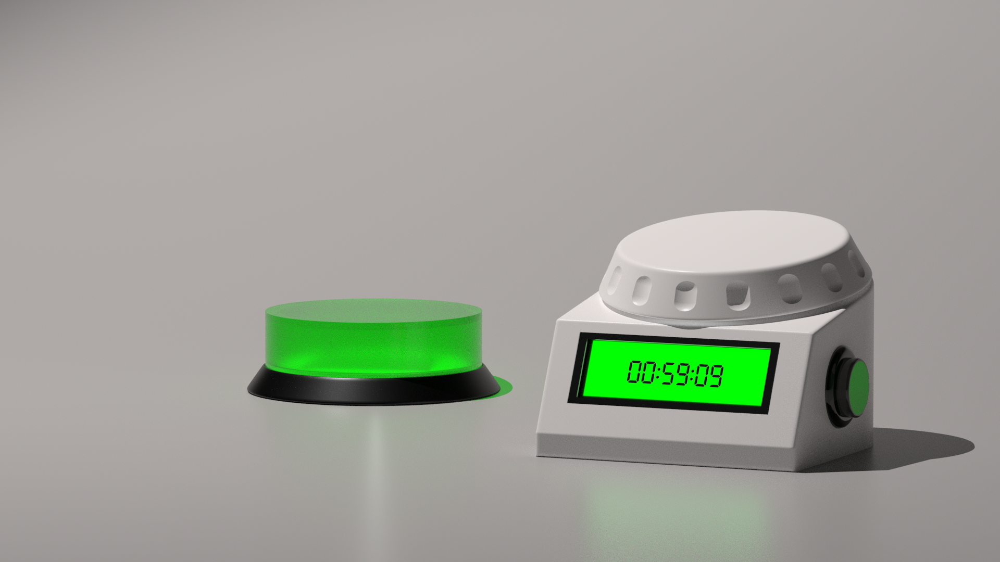
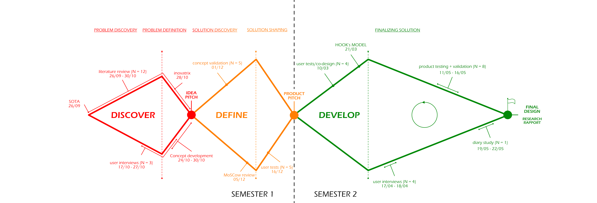
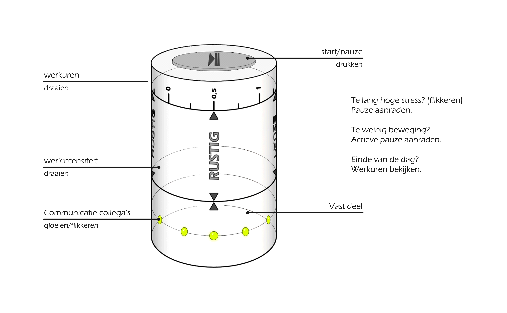
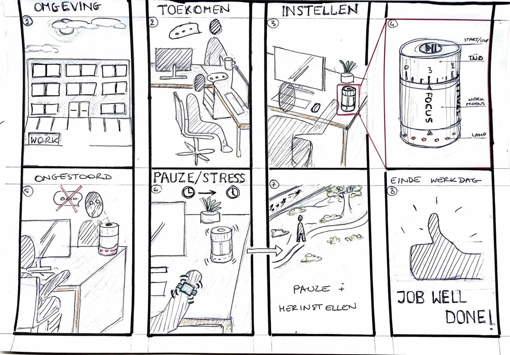
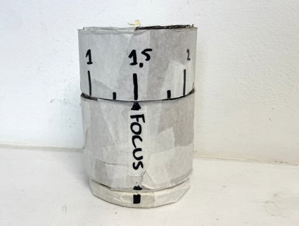
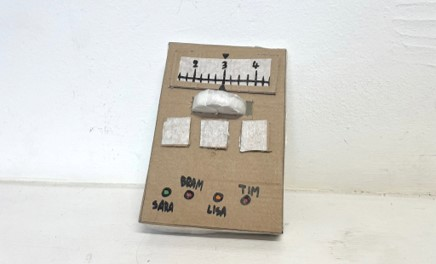
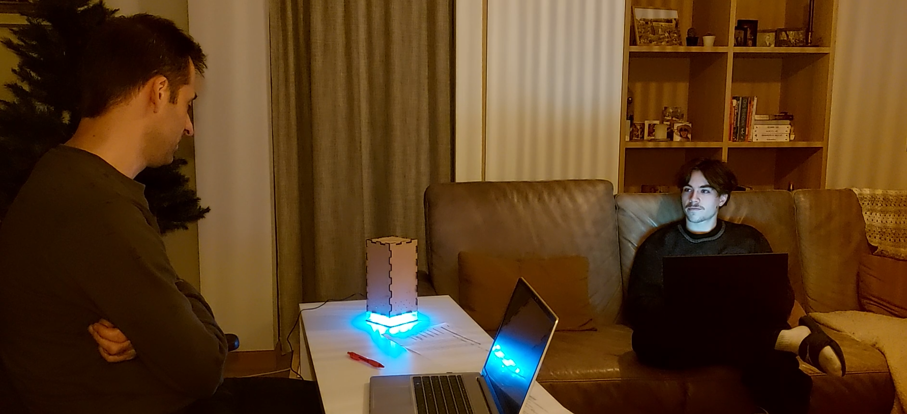
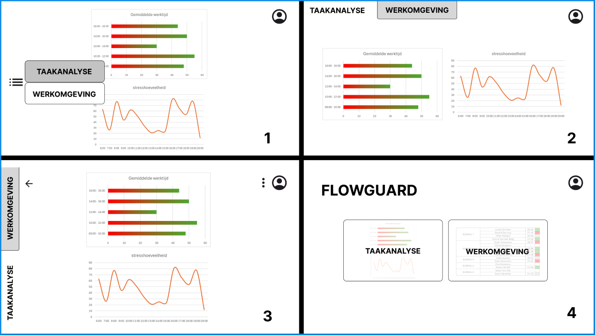
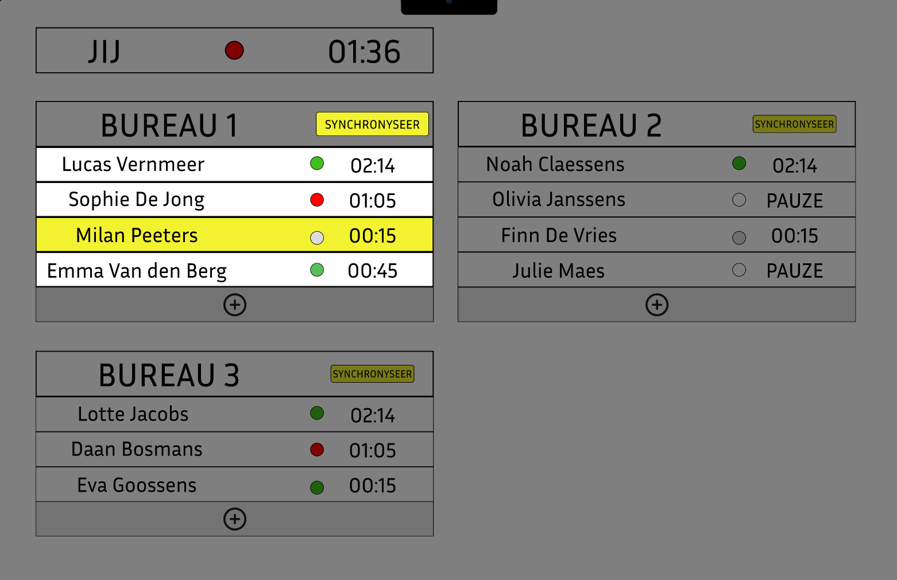
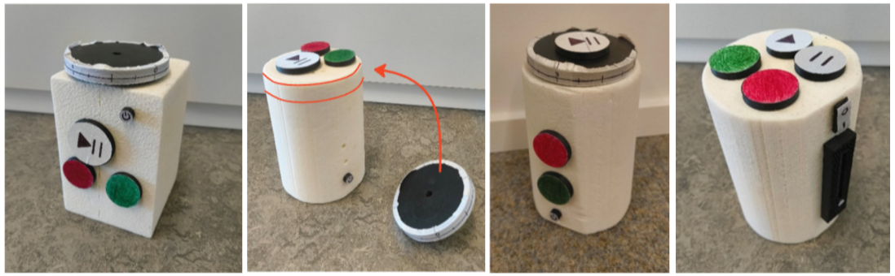

# FlowGuard
*De bureau-tool die helpt om een efficiënte en gezonde workflow te onderhouden.* 

*Projectteam: Daan Dobbelaere; Jasper Dekeyser*

*23/09/2024 - 23/05/2025*

## Samenvatting
In de moderne kantooromgeving is er vaak stress en werkdruk, terwijl deze vaak te vermijden zijn. Onnodige stress en werkdruk kunnen leiden tot mentale en onrechtstreeks fysieke zorgen en in extreme gevallen tot een burn-out. 

Uit meerdere literatuuronderzoeken en interviews met relevante participanten blijkt dat dit grotendeels ligt aan het feit dat men tegenwoordig constant bereikbaar is via de gsm en computer, maar ook dat er niet genoeg rekening gehouden wordt met elkaar. Dit laatste is vaak een gevolg van slechte communicatie of gaat over zaken die moeilijk te communiceren zijn, zoals stress.

In het zoeken naar een oplossing werden naast de literatuuronderzoeken en interviews ook andere ontwerpmethodes gebruikt om de onderliggende oorzaken te zoeken en tot een concrete oplossing te komen.

De oplossing die in dit dossier wordt voorgesteld is een product dat helpt om een gezonde balans te onderhouden tussen werken en pauzes, zonder daling in werkefficiëntie of werkeffectiviteit. Daarnaast kan het zorgen voor complete focus, zonder afleiding van de omgeving door het wegfilteren van onnodige meldingen en onnodige onderbrekingen door collega’s. Het product brengt een gevoel van voldoening met zich mee dat wordt gezocht in iedere werkdag.
 

  
  

> [!NOTE]
> - Links naar volledige protocollen en rapporten met de bijhorende ruwe data zijn terug te vinden onder [bijlagen](#bijlagen).
> - Arduinocodes, NX-bestanden, 3D-files, renders, ... zijn te vinden in de bijhorende mappen.

## Introductie
Volgens het Rijksinstituut voor ziekte- en invaliditeitsverzekering (Riziv) zijn 36,44% van de mensen in invaliditeit op 31 december 2021 arbeidsongeschikt door een psychische stoornis en 66,39% daarvan door een depressie of een burn-out. De werkdruk en stress tijdens de job spelen hier een grote rol in, maar ook de constante bereikbaarheid via mail, berichten, sociale media, op de werkvloer, ... zorgen voor een daling in werkefficiëntie met als gevolg een stijging in stress en werkdruk. Stress en werkdruk die te vermijden zijn…

Eerder dit jaar werd gekozen tussen verschillende design-challenges en hieruit kwam deze challenge voort, namelijk stress, werkdruk en pauzes verbeteren bij werknemers die dagelijks aan een bureau werken in een kantooromgeving. Het is de bedoeling dat het product deze problemen oplost door regelmatig pauzes aan te raden, de werkstatus te communiceren met collega’s en voldoening te geven bij het geleverde werk.

Dit is een alledaags probleem en komt voor bij meerdere doelgroepen, denk bijvoorbeeld aan studenten. Om dit probleem te begrenzen en de oplossing zo gebruiksgericht te kunnen ontwerpen, is er gekozen voor de doelgroep kantoormedewerkers die dagelijks het merendeel van de dag aan een bureau werken. Als een oplossing wordt gevonden voor deze doelgroep, kan verder gekeken worden naar andere doelgroepen met een gelijkaardig probleem.

**Bron**  
Langdurige arbeidsongeschiktheid: Hoeveel langdurige burn-outs en depressies? Hoeveel kost dat aan uitkeringen?  | RIZIV. (z.d.). https://www.riziv.fgov.be/nl/statistieken/statistieken-uitkeringen/langdurige-arbeidsongeschiktheid-hoeveel-langdurige-burn-outs-en-depressies-hoeveel-kost-dat-aan-uitkeringen#Een_toename_van_46%_van_langdurige_burn-outs_en_depressies_in%C2%A05%C2%A0jaar

## Methodologie
In dit project werd gebruik gemaakt van onderstaande ontwerpmethodologie, die is gebaseerd op de "triple diamond".

Het eerste semester werden de Discovery- en Define-fase doorlopen, oftewel de eerste twee "diamonds". Er werd in de Discovery-fase vooral gefocust op het onderzoeken van het probleem, het afbakenen van de doelgroep en het bedenken van een eerste concept. In de Define-fase werd gefocust op het valideren van het concept en werd er op die manier gekeken of alles van de Discovery-fase goed was geanalyseerd. In het tweede semester werd dan vooral gefocust op het concept vormgeven en verfijnen, zodat het proces eindigde met een concreet product.  
 
Zoals men kan zien werden in de eerste fases pas laat geconvergeerd om tot een concept te komen. Dit kwam door de deadlines en de vele info die moest verzameld en geanalyseerd worden.
 
 

## Discovery (N = 15)

### Doelstellingen
De doelstelling van de discovery-fase was vooral het probleem begrijpen en omvatten. De eerste manier om dit doel te bereiken was om van het probleem, namelijk stress en werkdruk, terug te brengen naar de oorzaak. Een tweede methode was om de omvang van het probleem te begrijpen en kijken hoe dit probleem kan worden vastgesteld.
### Materiaal & methoden
 #### SOTA-schema (zie bijlagen)
 Alvorens methoden en doelstellingen werden vastgelegd, werd eerst gekeken wat men persoonlijk wist van dit probleem.
 #### User interview (N = 3)
 In dit onderzoek werd teruggegaan naar de oorzaak van de stress en werkdruk bij verschillende personen. Omdat iedereen dit anders kan ervaren en hier een dieper inzicht nodig was werd geopteerd voor een user 
 interview.
 De interviews werden uitgevoerd en samengevat aan de hand van een protocol en rapport. 
 #### Liturature review (N = 12)
 Bij de literature review werd gekeken naar de grootte en omvang van het probleem, hoe stress gemeten kan worden en in welke mate de kantooromgeving de fysieke en mentale gezondheid beïnvloedt.
 De liturature reviews werden uitgevoerd en samengevat aan de hand van een protocol en rapport.

### Resultaten
De liturature review werd uitgevoerd doorheen de volledige discovery-fase en werd uitgevoerd aan de hand van een protocol en rapport (zie bijlage). De belangrijkste zaken die hieruit worden afgeleid, zijn hieronder weergegeven:
- **Methode om stress te meten**: Om stress goedkoop, maar toch zo correct mogelijk te meten, zou er best gebruik gemaakt worden van hartslagmeting, mogelijks gecombineerd met galvanische  huidrespons. De hartslagmeter kan zonder persoonlijke aanpassing toch een accuraat beeld van de stress weergeven, het werkt namelijk op basis van hartslagvariabiliteit en niet op de hartslagwaarde zelf, zo zijn er geen problemen bij mensen die van nature een hoge hartslag.
- **Het probleem is groter dan gedacht.** Niet alleen in de kantooromgeving, maar ook bij veel andere jobs en zelfs bij studenten is dit probleem aanwezig. Dit zijn doelgroepen die met behulp van kleine aanpassingen aan het eindproduct er misschien ook gebruik van kunnen maken. Om het product tot stand te brengen zal de doelgroep echter beperkt blijven tot kantoorjobs.
- **Weinig fysieke beweging.** Dit is niet het hoofdprobleem dat in dit proces onderzocht wordt of behandeld, maar kan een oorzaak zijn van stress in de context van het gekozen probleem en wordt verder onderzocht in de user interviews.
- **Stress en werkdruk**: Meerdere zaken spelen een rol, namelijk de omgeving, kwaliteit van werken, organisatie, werkhoeveelheid, ... Of deze allemaal van toepassing zijn zal ook nader onderzocht worden in de user interviews.
- **Sociale media en technologie.** Dit speelt grote parten in de stress en werkdruk. De afleiding is groot en heeft een negatief effect op productiviteit, stress, werkdruk en de mentale gezondheid.
> “Ons brein is nog altijd niet goed bestand tegen Whatsapp, e-mail en Zoom.”

Bij de user interviews werden een drietal respondenten ondervraagd en werden de overgebleven onduidelijkheden in de liturature review onderzocht. Onderstaande zaken kwamen meerdere malen naar voor:
- **Moeilijkheid om lange tijd aan een stuk te concentreren.** Alle respondenten zijn het eens over het feit dat er tegenwoordig meer afleidingen zijn. Door meldingen van gsm's maar ook door collega's die storen, of andere afleidende zaken.
- **Te weinig voldoening halen uit je job.** Hoewel dit niet van toepassing was bij de respondenten gaven ze aan dat dit een grote oorzaak is van stress en burn-out.
- **Communicatie.** Hierbij worden vaak problemen ondervonden die onnodig zijn. Dit kan gaan van frustraties die niet kunnen geuit worden, tot persoonlijke zaken waarbij men zich niet comfortabel voelt om ze te delen of aarzeling om hulp te vragen.
- **Fysieke beweging.** Dit werd niet zozeer gemist, omdat men dit makkelijk inhaalt buiten het werk. Dit mag dus geschrapt worden als oorzaak van stress.
- **Pauzes.** Hier is zeker ruimte voor verbetering. Ze worden vaak vergeten, niet genoeg gestimuleerd en dit geeft een kans om even weg te zijn van de stresserende omgeving.

### Conclusies & implicaties
De grootste problemen op de moderne werkvloer zijn de communicatie, afleiding, gebrek aan voldoening en weinig initiatief tot pauzes. Het feit dat men vandaag de dag constant bereikbaar moet zijn, zorgt voor constante onderbreking tijdens het werken. Deze nieuwe vormen van communicatie zorgen ook dat er minder vlotte en duidelijke communicatie is tussen collega's, waardoor kleine problemen ontstaan die uitgroeien tot grotere, vermijdbare problemen. Hieruit volgt dat het product moet kunnen communiceren en empathie opwekken. Dit is belangrijk voor de groepssfeer en de werkefficiëntie. 
Het onderdeel werkefficiëntie is zeker een hoofdzaak en staat verbonden met de andere deelproblemen: het product moet kunnen aangeven wanneer iemand geconcentreerd en gefocust bezig is om onnodige afleiding te beperken of zelfs te vermijden. Hierdoor zal er meer werk gedaan zijn en zal de werkdruk het thuiswerk verminderen. Een ander belangrijk aspect is de stress, aangezien dit moeilijk te zien is en moeilijk valt te communiceren. Er is nood aan stressmeting en stressreductie, mogelijk door pauzes of andere rustmomenten.
 
Een extra toevoeging zou kunnen zijn om te zorgen dat de gebruiker meer voldoening heeft na een werkdag. Dit, gepaard met aansporing tot meer fysieke beweging en de eerder vermelde zaken, zou het product veel mogelijkheden bieden om de werkvloer aangenamer en minder stressvol te  maken.
 
 
<ins> Om deze zaken duidelijker te kaderen en te verwoorden in requirements, werd een innovatrix ingevuld (bijlagen)
 
 
> [!IMPORTANT]
> Design Requirements:
> - D1.1 Het product moet pauzes aanraden
> - D1.2 Er moet tijdens pauzes beweging aangeraden worden
> - D1.3 Het product moet tijdens het werken onnodige meldingen van de gsm wegfilteren
> - D1.4 Werktijd en pauzetijd moeten duidelijk gescheiden worden
> - D2.1 Werkstatus moet onderling gedeeld kunnen worden
> - D2.2 Een focusstand moet gebruiker ongestoorde focus en rust bieden
> - D2.3 Focus moet gerespecteerd worden door collega's (empathie opwekken)
> - D2.4 Stress moet gemeten en gecommuniceerd worden
> - D3.1 Gebruiker voldoening hebben aan einde van de dag
> - D4.1 Stress wordt gemeten a.d.h.v. hartslagvariabiliteit 
 
Hierna kon een correct en innovatief eerste concept opgesteld worden.
 
 
  
 
 

## Definition (N = 10)

Na de goedkeuring van dit concept werd gefocust op definiëren van het concept en het krijgen van een beter beeld van de uiteindelijke vereisten van het product. Dit werd gedaan aan de hand van twee testing waves uitgevoerd door telkens vijf testpersonen uit de doelgroep. 

Uit de discovery-fase kunnen de belangrijkste aspecten van de oplossing gebundeld worden:
1. Werkefficiëntie verhogen
2. Onderlinge communicatie verbeteren
3. Pauze en voldoening

Om beter te kunnen bekijken waar er nog onduidelijkheden zijn, werd eerst een storyboard uitgewerkt met als onderwerp het eerste concept van wave 1 en dit werd dan ook geanalyseerd.
 

 
  
### <ins>Wave 1: conceptvalidatie</ins> (N=5)

#### Doelstellingen
Het doel van deze conceptvalidatie is om het eerste concept met een paar mockups voor te stellen aan de doelgroep en hun meningen, inzichten en onduidelijkheden te capteren. Op deze manier kan gekeken worden of dit concept aan de eisen van de doelgroep voldoet.
#### Materiaal & methoden
Testpersonen maken kennis met het concept en er worden enkele open, maar gerichte vragen gesteld. Voor een gedetailleerd stappenplan kan worden gekeken naar het protocol (bijlagen). 
Benodigdheden zijn:
- een laptop om de antwoorden te capteren
- een dictafoon voor spraakopname
- twee quick-and-dirty prototypes gemaakt om mee te interageren
 **De prototypes dienen dus vooral om het concept te communiceren met de doelgroep op visueel vlak**.

  
  

#### Resultaten
**Stress.** Stress wordt door iedereen ervaren als een onvermijdelijk deel van het werk, waarbij een duidelijke scheiding tussen werk en privé essentieel is om een gezonde balans te behouden.

**Fysieke beweging.** Over beweging tijdens het werk verschillen de meningen: sommigen vinden dat er meer moet worden bewogen of rechtgestaan, maar een kleine meerderheid vindt dat niet nodig tijdens de werkuren. Hierdoor wordt D1.2 kan weggelaten in de designrequirements.

**Pauzes:.** Het idee van pauzes <ins> op basis van tijd </ins> wordt door iedereen als vanzelfsprekend gezien. Het zelf kunnen instellen van werk- en pauzelengtes is een must en sommigen opteren voor een optie om de pauze nog net iets uit te stellen, indien men nog niet klaar was met een taak. 
Er werd door iemand voorgesteld om pauzes synchroon te laten verlopen met andere collega's tijdens teamactiviteiten, zoals vergaderingen of telefoongesprekken, om efficiënter te werken als een team. Pauzes <ins> op basis van stressmetingen </ins> wordt door de meesten positief ontvangen en de meesten zijn dan ook bereid om daarvoor externe apparatuur te dragen. Twee participanten waren hier minder fan van en stelde voor om het als een optie aan te bieden. 

**Meldingen.** Indien technologisch mogelijk, zouden sommigen het wenselijk vinden om meldingen van de gsm te synchroniseren met het product en niet-essentiële meldingen weg te filteren.

**Vormgeving.** Het product wordt meerdere malen geassocieerd met een eierklokje, alleen wordt het niet gewenst dat het voortdurend gaat tikken tijdens het aftellen. Het product was groot genoeg om op te vallen. Indien er symbolen of woorden gebruikt worden, zou de betekenis zeer duidelijk moeten zijn en liefst in het Nederlands.

**Communicatie.** De participanten benadrukken het respect voor de rust van collega’s en bevestigen de bijdrage dat het product kan leveren op vlak van communicatie. Live-updates over stress worden minder op prijs gesteld, omdat deze mogelijk meer afleiden dan bijdragen.

**Dagelijkse evaluatie.** De evaluatie van werkprestaties en stressniveaus wordt door de meeste deelnemers gewaardeerd. Dit helpt hen reflecteren op hun werkdag en geeft inzicht in hun productiviteit. Een enkeling uitte echter zorgen dat dit juist zal zorgen voor ontevredenheid.

Vrijwel iedereen benadrukte het belang van **persoonlijke aanpassingsmogelijkheden**. Dit ging over voor werk- en pauzeduur, synchronisatie en filtering van meldingen, het meten van stress door externe apparatuur en de soorten analyses op het einde van de dag. Ook mocht alles niet te lang duren om in te stellen om het gebruiksgemak en de werkefficiëntie hoog te houden.

#### Conclusies & implicaties
Het concept is zeer gewild binnen de doelgroep, maar er moeten met enkele zaken rekening gehouden worden. Het product moet een ****intuïtieve instelling**** van werk- en pauzetijden bieden, met de mogelijkheid om pauzes uit te stellen of synchroon in te plannen met collega's. **Stressmetingen** kunnen als optionele functie worden geïntegreerd om melding te doen aan de gebruiker of pauzes te vervroegen. Indien mogelijk moeten storende **meldingen gefilterd** worden tijdens focusstand. Wat betreft de vormgeving moet het product **herkenbaar en opvallend** zijn, met duidelijke symbolen en tekst in het Nederlands. Een visuele indicator voor **focusstatus** moet aanwezig zijn, liefst een **kleurlicht**. Ten slotte moeten gebruikers instellingen kunnen **personaliseren**, omdat iedereen op een andere manier werkt.
#### MoSCow review

 

### <ins>Wave 2: vorm van communicatie</ins> (N=5)

#### Doelstellingen
Het product zal in staat moeten zijn om duidelijk te communiceren. Bij het gebruik van het product zullen er twee vormen van communicatie voorkomen: het aanraden van pauzes naar de gebruiker toe (product – gebruiker) en het communiceren van de werkstatus met collega's (product – collega's). Met de volgende testen wordt gekeken welke signalen het best gebruikt worden.
#### Materiaal & methoden
Er wordt geopteerd om de testen uit te voeren in de juiste context, dus worden deze uitgevoerd bij vijf participanten in een vooraf gecontacteerd kantoor. Een gedetailleerd stappenplan voor de twee uit te voeren testen is te vinden in het protocol van Wave 2 (bijlagen). 
Volgende zaken zijn nodig:
- een laptop met een typetest
- een prototype dat licht kan geven, geluid kan maken en kan trillen
- een smartwatch die kan trillen
- een laptop om te noteren/context te simuleren
- een gsm om interactie en reactie te capteren (filmen)  
  
Het prototype is een doos gemaakt uit MDF en plexiglas met ruimte om een smartphone in te plaatsen en focust puur op de functie om signalen te kunnen verzenden en is niet bedoeld om het voorkomen van het product te representeren. 
Voor deze test wordt dus gekozen voor een **functioneel, ruw prototype** in de plaats van een esthetisch prototype.

#### Resultaten
##### <ins> Test 1 (product - gebruiker):

 
Onderstaande tabel bevat de gemiddelde scores van alle participanten. Voor de scores per participant kan gekeken worden in het rapport van Wave 2.
 
 

|   | Gekleurd licht | Flikkerend licht | Geluid  | Trillen hub   | Trillen armband   |
| -------- | :---: | :---: | :---: | :---: | :---: |
|**Hoe hard valt het signaal op?** | 2.2 | 3.2 | 4.6 | 3.4 | 3.75 |
|**Hoe aangenaam is het signaal?** | 4.4 | 3.4 | 3.2 | 2.8 | 3 |
|**Hoe hard zet het signaal je aan tot actie?** | 2.8 | 3.2 | 4.2 | 2.6 | 3.5 |
|**Hoe snel leidt het signaal je af?** | 2.6 | 3.4 | 4.4 | 2.8 | 4 |
|**Hoe moeilijk is het signaal te negeren? (in het geval dat het eindeloos doorgaat)** | 2.2 | 3 | 4.6 | 3 | 4.5 |
|**Hoe afleidend is het signaal voor je collega’s en omgeving?** | 2.2 | 3 | 4.8 | 4.6 | 1.5 |

Uit het gemiddelde van de vijf testpersonen kunnen onderstaande zaken afgeleid worden.
- **Gekleurd licht** is het aangenaamst en stoort de omgeving bijna niet, maar het valt het minst op en motiveert minder om actie te ondernemen.
- **Flikkerend licht** trekt iets meer aandacht en zet meer aan tot actie, maar wordt als minder aangenaam ervaren dan gekleurd licht.
- **Geluid** valt het meest op en zet het meest aan tot actie, maar het is zeer storend voor andere collega’s. Het geluid kan ook als het bel- of alarmsignaal van een gsm geïnterpreteerd worden, wat verwarrend kan zijn door andere gsm's aanwezig in de kantoorruimte.
- **Trillen via de hub** is redelijk opvallend en stoort de omgeving niet veel, maar het activeert het slechtst en wordt als het minst aangenaam ervaren. Dit komt waarschijnlijk door de associatie met het trillen van een gsm. Eén van de testpersonen had het trilsignaal zelfs niet opgemerkt omdat hij dacht dat het een gsm van de observators was.
- **Trillen via een armband** biedt een mooie balans: het trekt voldoende aandacht, motiveert goed tot actie en stoort collega's bijna niet. Het signaal is vrij lastig te negeren, maar op aangenaamheid scoort de armband maar middelmatig.

 > “Als stress op een andere manier wordt gemeld, waardoor je zeker weet dat je stress hebt, dan zal dit leiden tot meer stress”
 

##### <ins> Test 2 (product - collega's):

 
Onderstaande tabel is een samenbundeling van de antwoorden van alle participanten. Voor de antwoorden per participant kan gekeken worden in het rapport van Wave 2.
 
 

|   | Groen  | Geel | Oranje  | Rood   | Blauw   | Wit  |
| -------- | --- | --- | --- | --- | --- | --- |
|**Welke emotie roept deze kleur op?** | - rust   - toegankelijk  - bereikbaar | - ruime inbreng, van oppassen voor stress tot feest | - tussen groen en rood   - vooral een gevoel van stress en opletten   - eerder aan de kant van rood | - opgelet! - stress!  - gevaar!  - focus! | - rust  - kalmte  - pauze   - minder streng kleur| - neutraal  - sfeerlamp |
|**Wat zou de reden zijn dat jouw collega deze kleur zou gebruiken?** | - bereikbaar  - rustige taak - mails checken  | - taken waarbij je liever niet gestoord wordt, maar het is geen groot probleem | - niet storen  - stressvolle taak - druk bezig |  - zeer gefocust werk   - niet storen anders ben ik de kluts kwijt | - pauze   - rustige taak | - geen opdracht   - misschien pauze |
|**Wat denk je dat hij/zij op dat moment aan het doen is?** | zie hierboven | zie hierboven | zie hierboven | zie hierboven | zie hierboven | zie hierboven |

**Rood en groen** brengen een eenduidige emotie op bij alle participanten. Dit zorgt ervoor dat deze kleuren makkelijk geïntegreerd kunnen worden in het concept zonder veel uitleg of moeilijkheden. Een aantal van de andere kleuren brengen ofwel zeer verschillende gevoelens naar boven ofwel zeer neutrale. Deze kunnen met enige duiding gebruikt worden in het product, zonder dat hierover verwarring ontstaat.
 **Blauw, wit en andere meer extrinsieke kleuren**: Deze brengen verwarring en geven bij iedereen een ander gevoel. Dit kan misschien voor een specifieke functie/interactie gebruikt worden.
 **Oranje en geel**: Deze staan tussen rood en groen, maar geven ook geen eenduidig gevoel bij de participanten, waardoor ze moeilijker intuïtief te gebruiken zijn.
 
 

#### Conclusies & implicaties
Het <ins> communiceren van product naar werknemer </ins> moet eenduidig zijn en moet genoeg aandacht trekken naar de gebruiker toe. Anderzijds moet worden vermeden dat collega's hiermee worden gestoord. Het product zal dus gebruik maken van een **trillende armband** om met de gebruiker te communiceren. Omdat velen het trilsignaal toch niet zo aangenaam vonden, kan er misschien gewerkt worden naar een masserend trilpatroon. 

Bij de <ins> communicatie van het product naar de collega's </ins> wordt gezocht naar kleuren die bij de meeste participanten hetzelfde gevoel oproepen of kleuren waar nog een inbreng aan kan worden gegeven. In het algemeen volstaat **groen en rood** om duidelijk aan te geven of men beschikbaar is of niet. Te veel onderverdelingen van deze kleuren zoals geel of oranje zijn minder gewenst. Kleuren zoals blauw en wit staan open voor interpretatie en kunnen eventueel nog een betekenis geven aan secundaire functies van het product.

> [!IMPORTANT]
> Design Requirements:
> - D1.2 ~~Er moet tijdens pauzes beweging aangeraden worden~~ 
> - D2.5 De stressmeting moet kunnen uitgeschakeld worden indien gewenst
> - D2.6 De focusstand van de gebruiker wordt gecommuniceerd met een visuele indicator, namelijk kleur
> - D2.7 Communicatie van product naar gebruiker mag de omgeving niet storen
> - D2.8 Communiceren van product naar gebruiker gebeurt met een trillend, masserend patroon op de pols
> - D2.9 Om de focusstand te communiceren worden de kleuren groen en rood gebruikt
> - D4.2 Het product is snel en intuïtief in te stellen
> - D4.3 Het product kan op elk moment opnieuw worden ingesteld of de instellingen worden aangepast
> - D4.4 Het voorkomen van het product is opvallend en zichtbaar om aandacht op zich te kunnen brengen
> - D4.5 Tekst op het product dient in het Nederlands te zijn
 
 

## Develop (N = 17)
 

### Develop 1 (N = 4)

#### Doelstellingen
Om de volgende stappen in het proces makkelijker te maken en het product meer te definiëren is er nood aan een interface. Deze zal het fysieke aspect van het product bepalen en de integratie van elektronica meer geordend maken. In deze test zal gekeken worden waar de interacties zich bevinden op de centrale interface samen met de indeling van de website die bij het product hoort. 

#### Materiaal & methoden
Om deze test te realiseren wordt gebruik gemaakt van een interactief, 'think aloud' interview om de indeling van de interface te bepalen en een interactief website-prototype op Figma om deze lay-out te onderzoeken en te beoordelen. Om de vier participanten zoveel mogelijk vrijheid te geven en de indeling van de interface worden geen vooraf gemaakte interfaces aangeboden maar lege schuimmodellen waarop ze zelf de knoppen kunnen ordenen. De gebruikte zaken zijn:
- Simpele schuimvormen (balk en cilinder)
- Interacties in de vorm van knoppen per functie (tijd instellen, start/pauze, aan/uit, groen/rood)
- Een smartphone om conversaties op te nemen
- Vier afgeprinte informed consents
- Een laptop om het protocol voor te lezen en de resultaten te noteren
- Een laptop om voorbeelden van de centrale interface te tonen en de website te simuleren

De vooraf gemaakte lay-out's voor de website en het tabblad specifiek voor de functie in verband met synchroniseren van pauzes worden getest met onderstaande simulaties:

  
  

Deze lay-outs kunnen worden getest met volgende link: [prototype websites](https://www.figma.com/design/WJBzaDU9i3cPEKHMzfiFzu/websites?node-id=0-1&m=dev&t=i1vy643DXOuWa7JA-1)
Naast de lay-out van de website wordt ook 
 
Om de beste lay-out er uit te halen wordt aan de participanten gevraagd om de websites van beste tot minst goed te ranken. Verder wordt gekeken naar moeilijkheden bij het gebruik van de websites door live mee te kijken, maar ook door schermopnames te maken en deze achteraf te analyseren.

#### Resultaten
##### <ins> Centrale interface </ins>
- **Vorm.** Een cilinder heeft meest vriendelijke en organische uitstraling en het minst robuust.
- **Knop tijd instellen.** Een draaiknop heeft de voorkeur doordat deze mooi in de centrale vorm geïntegreerd kan worden en zeer intuïtief werkt.
- **Knop aan/uit.** De drukknop krijgt de voorkeur, omdat zijn kleine omvang het minst opvalt. Er moet wel duidelijke feedback zijn in welke staat hij zich bevindt. Hij mag zich op een minder toegankelijke plek bevinden, aangezien hij niet vaak gebruikt zal worden.
- **Knop starten/stoppen.** Een enkele drukknop die zich bovenop het toestel bevindt, is het best voor gemakkelijke en snelle toegankelijkheid. Het indrukken van deze knop geeft een duidelijk gevoel van de start van een werkperiode. Duidelijkheid over huidige staat van knop is zeer belangrijk, dus daar moet rekening mee gehouden worden.
- **Knop groen/rood.** Twee drukknoppen moeten vrij groot zijn om makkelijk te bedienen, liefst ook op een toegankelijke plaats. De kleurlichten moeten duidelijk zijn en een groot oppervlak bedekken, maar mogen niet te fel zijn. De lichten moeten ook zichtbaar zijn als bureaus visueel van elkaar gescheiden worden. Ook hierbij is de staat van de knop zeer belangrijk, maar die wordt al snel duidelijk door de kleur van het licht.

Onderstaande interfaces werden ontworpen tijdens het interactief ontwerpen:

##### <ins> Website interface </ins>
<ins> Lay-out </ins>
- Website 1 is goed door het strak design, maar slechter doordat er meer clicks nodig zijn.
- Website 2 en 3 worden als gelijkaardig beschouwd en zijn goed doordat de functies duidelijk zijn weergegeven. De voorkeur ging toch naar website 3.
- Website 4 is goed doordat visueel duidelijk is naar welke tabbladen de knoppen leiden.

Er werd ook gevraagd naar een rangschikking van beste naar slechtste lay-out: dit is weergegeven in onderstaande tabel.

| participant | lay-out 1 | lay-out 2 | lay-out 3 | lay-out 4 |
|------|---|---|---|---|
| **1** | 1 | 2 | 3 | 0 |
| **2** | 1 | 3 | 2 | 0 |
| **3** | 3 | 0 | 1 | 2 |
| **4** | 0 | 1 | 2 | 3 |
| **TOTAAL** | 5 | 6 | 8 | 5 |

<ins> Tablad werkomgeving </ins>
 
Bij het testen van de interacties op de website werden snel enkele zaken duidelijk. Om alle opmerkingen te zien of enkele schermopnamen kan gekeken worden naar het rapport van deelopdracht 3 (bijlagen). De belangrijkste zaken zijn hieronder weergegeven.
- **Tutorial**: Na de website even te proberen en enkele fouten te hebben gemaakt was iedereen ervan overtuigd dat ze deze niet meer opnieuw zouden maken. Een tutorial of korte uitleg over de werking zou dus helpen.
- **Tijdsaanduiding**: Er moet duidelijker getoond worden of het over uren of minuten gaat. Om dit te duiden met een voorbeeld: de meesten dachten dat 01:20 een timer was voor 1 minuut en 20 seconden, waar 1 uur en 20 minuten werd bedoeld.
Ook moet duidelijker getoond worden dat dit een aflopende timer is die overgaat in een pauze wanneer deze eindigt.
- **Licht uit**: Men was niet zeker wat de betekenis was van een licht dat niet aan stond.

> "Krijg je een melding als iemand met jouw timer synchroniseert?"

#### Conclusies & implicaties
Centrale interface:
Iedereen streeft naar een zo intuïtief mogelijk en esthetisch zo strak mogelijk ontwerp. Knoppen worden het liefst bijna blindelings en met één hand gebruikt. Indien mogelijk worden zo weinig mogelijk knoppen geprefereerd. Knoppen moeten tamelijk gegroepeerd zijn, zodat je er niet naar moet zoeken. Knoppen die vaker gebruikt worden, moeten groter zijn dan knoppen die minder vaak gebruikt worden. Ten slotte moeten knoppen duidelijke feedback geven en er mag geen twijfel zijn over de huidige staat van een product.
De lamp moet afzonderlijk van de centrale interface kunnen worden geplaatst. Dit zorgt voor een aanpassing van D4.4

Tabblad Werkomgeving:
- Er moet een duidelijk onderscheid zijn tussen de timer en de werkstatus.
- De tijdsaanduiding mag niet verwarrend zijn.
- Bij het eerste gebruik van de website moet er een kleine introductie zijn om duidelijkheid te scheppen.
- Synchroniseren gebeurt intuïtiever door eerst op "naam" te klikken en vervolgens op “synchroniseer” of door één grote “synchroniseer”-knop te voorzien en vervolgens op een naam.

> [!IMPORTANT]
> Design Requirements:
> - D1.6 Het starten van de timer moet aanvoelen als een mentale omschakeling van pauze naar werk
> - D2.10 Als de gebruiker niet aan de bureau zit gaat het licht uit
> - D4.4 Het ontwerp van <ins>de lamp</ins> is opvallend en zichtbaar om aandacht op zich te kunnen brengen
> - D4.6 Het product is in te stellen met één hand 
> - D4.7 De knoppen of instellingen geven geen twijfel over hun status
> - D4.8 De ondersteunende website heeft bij het eerste gebruik een tutorial
> - 4.19 Het product moet een strakke uitstraling hebben
 

### Develop 2 (N = 4)

#### Doelstellingen
Uit de vorige test blijkt dat een centrale hub op het bureau niet van overal te zien is, daarom zal de lamp moeten gescheiden worden van de centrale hub. In deze test worden de laatste onduidelijkheden aangepakt voordat een eerste volledig concept kan worden gemaakt. Onderstaande onduidelijkheden worden onderzocht.
-	Polsen bij gebruiker over plaatsing van de hub en de lamp op het bureau
-	Het "Hook model" wordt overlopen met de gebruiker
-	Het gebruik van een armband om te communiceren wordt in twijfel getrokken, dus zoeken naar alternatief

#### Materiaal & methoden
Omdat er drie verschillende zaken dienen getest te worden en hier uitgebreid wordt op ingegaan wordt geopteerd voor een user interview gepaard met een paar opdrachten waarbij luidop nagedacht dient te worden. De participanten kunnen bij deze opdracht niet in de context worden geïnterviewd door tijdelijke beperkte mobiliteit van het onderzoeksteam.  
Bij aanvang van de test werd het huidig concept geanalyseerd aan de hand van de 4 fases van het Hook model. (zie bijlagen)  
Hieruit kwamen enkele vragen die in het interview werden gesteld:
- Wat doet een de gebruiker net voor ze het product gebruiken?
- Is de gsm wegleggen een trigger om te starten met werken?
- Haalt de gebruiker genoeg rewards uit het product?
- Wat vindt men van een puntensysteem, competitie of analyse van persoonlijke vooruitgang als investment om het product te blijven gebruiken?  

Het gebruikte materiaal voor deze test:
- Een smartphone om conversaties op te nemen
- Vier afgeprinte informed consents
- Een laptop om het protocol voor te lezen en de resultaten te noteren
- Foto’s van bureaus in verschillende opstellingen
- Arduino circuit met LCD RGB backlight scherm, twee potentiometers en een schakelaar. De eerste potentiometer bestuurt de lichtsterkte van het scherm en de tweede potentiometer de
knippersnelheid. De schakelaar geeft de keuze om het scherm te laten flikkeren of stil te laten staan.
De bijhorende code van deze Arduino-opstelling kan men hieronder vinden: 

  
  

#### Resultaten

##### <ins> lamp- en interface positionering </ins>

Er wordt nogmaals bevestigd door de participanten dat de lamp op een plaats moet staan, zichtbaar voor iedereen en de interface binnen handbereik.

> “Uniformiteit bij de plaatsgeving van het licht binnen dezelfde organisatie is belangrijk, anders moet er telkens gezocht worden”

##### <ins> Triggers en de stored value van het product </ins>
Bij het overlopen van de triggers van het "Hook model" waren er geen opvallende bevindingen. De meeste gingen voor het werken een koffie of een thee halen, maar buiten dit waren er niet veel zaken waarop het product kan inspelen.
> "Koffie halen, en dan begin ik eraan."

Opvallend was het feit dat ieder van de participanten aangaf hun gsm aan de kant te leggen voor ze begonnen met werken. Wanneer werd voorgesteld om misschien de gsm te integreren in het product of de werking van het product afhankelijk te maken van het gsm-gebruik, was er weinig enthousiasme door volgende zaken:
- De gsm is nodig voor het werk: bellen, Whatsappen, ...
- Sommigen halen hun gsm niet boven
- Wat als de gsm vergeet wordt vergeten?
- Vaak is er authenticatie met de gsm verreist en is deze dus ook meerdere malen nodig.
Het is dus duidelijk dat men de gsm vaak nodig heeft tijdens het werk en dit concept van integratie niet zo interessant zou zijn. Het product kan echter wel een niet essentiële functie hebben met betrekking tot de gsm.

Over het algemeen heeft men het gevoel dat er genoeg stored value zit in het product om het te blijven gebruiken. Bij het vragen naar extra stored value zoals puntensystemen werden volgende zaken aangehaald:
- Je kan moeilijk onderlinge taken vergelijken. Als de takenpakketten anders zijn, hoe kan je dan een competitieve meting doen?
- Er zijn al veel likes of andere uitingen van appreciatie op sociale media. Om dit nog eens toe te voegen in een kantooromgeving lijkt niet nodig.
- Het zou handig zijn om te zien hoeveel men het product gebruikt en op die manier ook anderen te motiveren om het te gebruiken

##### <ins> Gebruik van de armband en flikkerend licht als alternatief </ins>
Eerst werd gekeken wat men dacht over de weglating van de communicatie via de armband en de voorlopige weglating van de stressmeting tijdens dit project. De communicatie van product naar gebruiker zal, gebaseerd op een vorige test, gebeuren aan de hand van flikkerend licht en constant licht via de centrale hub. Iedereen ging akkoord met deze keuze en volgde de gedachtegang.

Bij het testen met de Arduino-opstelling werd aan de participanten gevraagd om aan te geven welke lichtintensiteit ze aangenaam vonden tijdens het werken, welke ze wilden, wanneer het product wou communiceren en welke snelheid het licht moest flikkeren als het product wou communiceren. De resultaten staan in onderstaande tabel.

| participant | lichtintensiteit constant | lichtintensiteit flikkeren | flikkersnelheid (ms) |
|------|---|---|---|
| **1** | 25 | 100 | 200 |
| **2** | 20 | 150 | 600 |
| **3** | 37 | 200 | 809 |
| **4** | 18 | 107 | 516 |

#### Conclusies & implicaties

##### <ins> Lamp- en interface positionering </ins>
- De scheidingswanden zijn een voorkeurslocatie voor de lampen omdat ze van overal goed zichtbaar zijn en men, afhankelijk van de kant waarop men de lamp plaatst, kan men zien aan wie de lamp toebehoort
- Sommige deelnemers kiezen ook voor een plaatsing op het scherm, maar geven aan dat dit misschien afleidend kan zijn voor zichzelf.
- De hub wordt het liefst dicht bij het scherm geplaatst, binnen handbereik.
- Uniformiteit in plaatsing binnen een organisatie is belangrijk om verwarring te vermijden.

##### <ins> Triggers en de stored value van het product </ins>
- De meeste gebruikers starten hun werkdag met eenvoudige routines zoals laptop, toetsenbord en muis koppelen aan scherm en iets halen om te drinken.
- Iedereen is tevreden met de huidige voordelen die het product biedt, maar sommigen merken op dat dit ook afhangt van de mate waarmee rekening wordt gehouden met het product.
- Onderlinge competitie lijkt een moeilijk concept, aangezien het niet duidelijk is wat er precies gemeten en vergeleken zou moeten worden en omdat iedere persoon een ander takenpakket heeft. Eén iemand geeft wel aan dat een speels/luchtig element het gebruik van het product kan stimuleren.
- Op persoonlijk vlak kan het wel interessant zijn om eigen verbetering te zien.
- Gebruiksgemak en een vlotte routine zijn belangrijk; te veel interactie of afhankelijkheid van de gsm wordt als hinderlijk ervaren.

##### <ins> Gebruik van de armband en flikkerend licht als alternatief </ins>
- De testpersonen gaan akkoord met onze vaststellingen rond de armband en het nieuwe alternatief: het flikkerlicht.
- Er is geen bezwaar tegen het weglaten van de stressmeting in dit project, vanwege de tijdsafbakening en de complexiteit.
- In het algemeen moet de lichtintensiteit voor het signaal hoger zijn dan bij normaal gebruik en moet het licht snel genoeg flikkeren om op te vallen, maar niet te snel om te storen. De exacte waarden worden in onderstaande tabel opgelijst.

| participant | lichtintensiteit constant | lichtintensiteit flikkeren | flikkersnelheid (ms) |
|------|---|---|---|
| **Gemiddelde** | 25,0 | 139,25 | 531,25 |

> [!IMPORTANT]
> Design Requirements:
> - D2.4 ~~Stress moet gemeten en gecommuniceerd worden~~
> - D4.9 De stressmeting is een optie die het eerste product niet zal bevatten
> - D2.8 ~~Communiceren van product naar gebruiker gebeurt met een trillend, masserend patroon op de pols~~
> - D2.11 Communiceren van product naar gebruiker gebeurt met een ledscherm
> - D4.10 De lamp moet zowel op een verticale als een horizontale vlakte bevestigd kunnen worden
> - D4.11 De hub staat binnen handbereik van de gebruiker
> - D4.12 Het product wordt aangeschaft door een bedrijf/organisatie, zodat iedereen deze kan gebruiken
> - D2.12 De gebruiker kan steeds de eigen timer bekijken
> - D4.13 Tijdens het werken staat het scherm op helderheid 25
> - D2.13 Bij het communiceren naar de gebruiker flikkert het scherm met een frequentie van 530 ms en is de helderheid 140
> - D4.14 Het instellen van het product moet geintegreerd worden in de dagelijkse werkroutine
> - D4.15 De integratie van de gsm mag geen verplichting zijn voor het gebruik van het product
 

### Develop 3 WAVE 1 (N = 8)

#### Doelstellingen
Na de vorige testen bleven slechts enkele onduidelijkheden over. Omdat deze niet genoeg waren om een test rond op te bouwen werd een concept uitgewerkt aan de hand van de requirements, tevens een finaal concept voor dit product wegens de tijdsafbakening. Dit concept werd zowel functioneel als esthetisch geprototyped om op die manier een usability test te kunnen doen waarbij nieuwe onduidelijkheden/problemen naar boven zullen komen om verder onderzoek mogelijk te maken. De doelstelling voor deze test is dus om de doelgroep te laten interageren met het product, de sterke en de zwakke punten eruit halen, de overgebleven onduidelijkheden/te onderzoeken zaken aan te pakken: 
- Hoe lang mag het licht maximaal op rood staan voordat het vanzelf uitvalt?
- Zijn de drie verschillende levels van lichtsterkte duidelijk in betekenis en visueel?
- Is de tijd vlot en intuïtief in te stellen met de huidige stapgroottes?
    - 30 sec (< 10 min)
    - 1 min (< 30 min)
    - 5 min (< 1 uur)
    - 15 min (> 1 uur)
- Hoe wordt de mogelijkheid van draadloos opladen van de gsm ervaren met daarbij de functie om meldingen vanzelf uit te schakelen?

#### Materiaal & methoden
Om het concept uit te werken werden eerst de designrequirements geordend op basis van hun belang. Hierna werden meerdere concepten geschetst, meerdere mogelijkheden uitgetekend en werd dan gekeken welke voldeden aan de designrequirements. Hieronder ziet men een overzicht van de schetsen. Na eliminatie en keuzes aan de hand van design requirements werd concept gekozen dat hieronder aan de rechterkant wordt geplaatst.

  
  

Om aan de requirements te voldoen werden sommige onderdelen van het prototype ontworpen aan de hand van ergonomie. Hiervoor werd de website van [DINBelg](https://www.dinbelg.be/) geraadpleegd. Omwille van de context werden volgende gemiddelden en standaarddeviaties (SD) gebruikt voor mannen en vrouwen van 18-65 jaar in zittende positie: handbreedte (knop, variërend met SD), ooghoogte en ellebooghoogte (berekeningen hoek van scherm, gemiddelde bureauhoogte = gemiddelde ellebooghoogte) en de reikafstand (berekening hoek van scherm + plaatsing hub). De bijhorende, verduidelijkende schetsen zijn hieronder te zien.

  

Het prototype bestaat hoofdzakelijk uit een in te stellen timer met digitaal scherm voor communicatie met de gebruiker en een lamp voor communicatie met de omgeving.
Deze combinatie van instellen van de timer, kleur van lamp, kleur van scherm en communicatie wordt verduidelijkt met volgend schema:

Om de werking van deze lamp te simuleren werd volgende Arduinocircuit gebouwd en geïntegreerd in het prototype, gemaakt volgens de conceptschets en met behulp van lasercutten en 3D-printen.

  
  

Bij dit circuit hoort volgende code:   
De test zelf bestaat uit een producttest en -validatie, gecombineerd met bijhorende vragen.

#### Resultaten
##### <ins> eerste confrontatie + vrije interactie </ins>
Bij het confronteren van de doelgroep met het product, na een korte introductie, lukt het iedere participant, zonder uitzondering, om alle delen van het product aan de juiste functie te koppelen. De enige fout die er werd gemaakt was het feit of op het scherm de focusstatus zou uitgetypt worden of niet.

De vorm van de hub lijkt niet storend te zijn, maar heeft nog ruimte voor verbetering. Zo halen sommigen aan dat de ronde, ergonomische knop niet samen hoort bij de strakke voorkant waar het scherm zit. De mogelijke vormgevingen werden echter beperkt tijdens het prototypen door de beschikbare componenten. Zo kon het product niet kleiner worden geprototyped dan de huidige opstelling. In de toekomst is er dus nog ruimte om betere, kleinere componenten te gebruiken om tijdens het ontwerpen van de hub nog meer vormvrijheid te hebben.
Buiten deze feedback zagen de participanten het product voor zich op hun bureau en zag het er simpel uit. 

> "Het lijkt een beetje op een apothekerweegschaal"

Tijdens de vrije interactie werden niet veel problemen ondervonden, er was geen tussenkomst nodig van de onderzoekers. Nog niet alle functies van het product werden uitgeprobeerd.

##### <ins> testen van enkele scenario's </ins>
**Plaatsen**
(centrale hub met lamp worden aan de gebruiker gegeven; de lamphouder wordt geplaatst op een plek, aangegeven door de participant)
1.	Waar zou jij de lamp plaatsen?  
   De meesten plaatsten deze op een hogere positie, zoals een akoestisch paneel of een muur, een minderheid plaatste hem op de hoek van hun bureau
2.	Verplaats de centrale hub met de lamp naar je bureau  
   Hier werden geen problemen ondervonden
3.	Geef de centrale hub een bereikbare plaats op je bureau  
   Meesten kiezen rechts van de laptop, sommigen links
4.	Plaats de lamp in de lamphouder  
   Geen problemen ondervonden    
**Instellen**
(product wordt met stroom geconnecteerd)
5.	Stel een werktijd van 01:15:00 in  
   Hier werden sommigen verrast door de gevoeligheid van de knop en hoe deze plots grotere stappen zette. Na eenmaal dit te hebben gedaan, was dit geen probleem meer.
  	Een participant stelt per ongeluk 1 minuut en 30 seconden in en start de timer. Toch beseft ze dit zelf en kan met gemak de juiste tijd instellen. Voor het grootste deel ging dit zeer vlot.
   > "Amai, dat gaat vlot!"
6. Start de timer  
   Dit lukt vlot voor iedereen. Het grootste probleem dat hier werd ondervonden was dat een tweetal participanten niet hard genoeg op de knop drukten, geen feedback kregen en daardoor andere dingen probeerden.    
**Gebruiken**
7.	Schakel de focusstand in  
   Geen problemen ondervonden
8.	Voeg een kwartier toe aan de tijd  
   Iedere participant probeert meteen te draaien aan de draaiknop, wanneer ze geen verandering zien in de timer begrijpen de meeste participanten dat ze eerst op pauze moeten drukken. Een meerderheid van de
   participanten kan de opdracht uitvoeren onder de 5 seconden en begrijpt het nut van deze constraint. Bij een tweetal participanten moeten de onderzoekers even tussenkomen, maar begrijpen ze het ook snel.
9.	Leg je gsm op de centrale hub om hem op te laden  
    Geen probleem
10.	Verlaag de timer naar 1 minuut en toon aan je collega’s dat je gestoord mag worden opbergen (product wordt uitgeschakeld)  
    Niemand maakt nog fouten na stap 8. Dit toont dat de fouten die bij vraag 8 werden gemaakt geen invloed hebben op de werking van het product of hoe intuïtief deze werking gaat.
11.	Neem de lamp en de centrale hub en berg het op  
    De lamp wordt door iedereen intuïtief op de lamp geplaatst, hoewel sommigen niet beseffen dat dit voor het opladen is. Er wordt aangehaald dat de magneet in de hub minder sterk is dan in de lamphouder.

Er wordt bij de laatste stap opgemerkt dat de lamp geen uit-knop heeft. Hoewel dit een terechte opmerking is, is hier wel een oplossing voor, maar kon deze niet in het product worden geïntegreerd.
Opdracht 10 is zo opgesteld, dat de timer tijdens opdracht 11 zal afgaan en dit ook zal signaleren naar de gebruiker.
Iedere participant, zonder uitzondering, werd meteen afgeleid en zag het signaal. Dit betekent dat het signaal efficiënt en effectief is. Er werd echter wel terecht opgemerkt dat er niet direct een knop is om dit signaal af te zetten, behalve de timer opnieuw instellen. Dit is een simpel, maar belangrijk op te lossen probleem.

##### <ins> bespreking voorgaande testen en onduidelijkheden </ins>
- De plaatsing van de lamp werd door alle participanten ervaren als gemakkelijk (de magneten helpen hierbij) en voelt stevig aan, met ruime plaatsingsmogelijkheden. Er waren enkele bezorgdheden of de lamphouder wel geplaatst kon worden op akoestische panelen en hoe stevig dit zou zijn en of het op iedere achterkant van een scherm kon hangen (die niet altijd recht is, maar vaak een gebogen vorom heeft).
> “Stevig, duidelijk, je kan niet missen”
- Alle participanten vonden het gebruik zeer simpel en intuïtief, de constraint dat er eerst op pauze moet gedrukt worden voor de de timer kan heringesteld worden, vond iedereen goed. Iedere fout dat werd gemaakt gingen de participanten slechts 1 keer maken.
Verder werd het ontbreken van een aan/uit-knop aangehaald, de associatie met een microgolftimer en dat de hub niet zeer vast staat op het bureau.
- De drie verschillende lichtsterktes van het scherm, afhankelijk van de tijd en status van de timer, werden niet door iedereen opgemerkt, wat positief is aangezien dit niet mag storen, behalve als timer afgaat. Nadat de onderzoekers dit nog eens toonden en de functie ervan aangaven, bevestigden alle participanten dat dit goed en nodig is. De meeste participanten halen aan dat het flikkersignaal, aangevend dat de timer afgelopen is, goed afleidt, maar snel afgezet moet kunnen worden.
> "Het is goed dat je niet je aandacht erop vestigt tijdens het werken."
- Het instellen van de timer, met name de variabele stapgroottes, vond niet iedereen even intuïtief. Zo werd meerdere malen aangehaald dat de stapgroottes in het begin te klein zijn in vergelijking met de stapgroottes op het einde en dat men daarom snel draait in het begin, niet direct stopt en plots meerdere uren op de timer heeft ingesteld. Als inbreng wordt meerdere malen een constante stapgrootte van 5 minuten voorgesteld. Dit sluit ook aan bij de pomodoromethode.
Anderzijds wordt ook aangehaald dat het een kwestie is van gewoon worden en wordt wederom de associatie gelegd met een microgolfoven.
- Bij het vragen naar de maximale tijd dat de gebruiker op focusmodus kan staan, om te vermijden dat de gebruiker zich hele dag afsluit van zijn omgeving, werd door alle gebruikers bevestigd dat er een limiet op moest staan. Echter gaven sommigen aan dat ze vertrouwen hadden in het feit dat iedereen dit voor zichzelf moest bepalen en moest naleven, sommigen zeiden maximaal een half uur en sommigen maximaal een uur. Een interessante ingeving was om te kijken wat de wetenschap hierover zegt: hoelang kan een persoon zich aan een stuk concentreren.
- De mogelijkheid om de lamp en gsm draadloos op te laden, en afhankelijk van de werkstatus bepaalde meldingen af te zetten, wordt door iedereen geapprecieerd. Dit zou helpen met focussen, maar ook met het wegleggen van de gsm, interactie met het product, besparen van stopcontacten en opladen van de lamp.
Dit is tevens de uitknop van het product: als de lamp op het product wordt gelegd, schakelt de hub uit. Op die manier vergeet men niet de lamp op te laden in de avond en moet er geen aan/uit-knop in de interface toegevoegd te worden, wat zorgt voor minder mogelijke gebruiksfouten.

#### Conclusies & implicaties
##### <ins> eerste confrontatie + vrije interactie </ins>
- De interface is duidelijk en laat geen ruimte voor onduidelijkheden of fout gebruik.
- De vorm van het product heeft nog verbetering op het vlak van afmeting en esthetiek.
##### <ins> testen van enkele scenario's </ins>
- Het gebruik van het product verloopt intuïtief, vot en na een paar testen ook foutloos.
##### <ins> bespreking voorgaande testen en onduidelijkheden </ins>
- De lamphouder moet een stevige positionering hebben, ook op oppervlakten gemaakt van stof of verf, zonder beschadiging aan te brengen. Hier zou best nog een onderzoek naar gebeuren in de vorm van een marktonderzoek.
- Het instellen, gebruiken, interageren en op-bergen/zetten van het product is intuïtief en simpel.
- Het flikkeren van het scherm, wanneer de timer afgelopen is, moet snel kunnen worden afgezet.
- De stapgroottes mogen beginnen met 1 minuut, 5 minuten en na een uur mogen deze verhoogd worden naar 15 minuten.
- De focusstand kan maximaal 1 uur gebruikt worden, daarna moet de gebruiker de focusknop nogmaals indrukken.
- De gsm moet draadloos kunnen worden opgeladen op de hub net als de lamp. Wanneer de lamp op de hub ligt, schakelt het product uit.

> “Het feit dat het goed werkt en eenvoudig lijkt, is omdat er veel achter zit”  
> "Ik zou het zeker willen gebruiken" x 8

> [!IMPORTANT]
> Design Requirements:
> - D1.5 De focusmodus kan maximaal een uur worden gebruikt, daarna moet deze status opnieuw worden bevestigd
> - D2.14 Het flikkeren van het scherm bij afloop van de timer kan met 1 beweging worden afgezet.
> - D4.14 Het product moet zo compact mogelijk zijn, zonder het gebruik te beperken
> - D4.15 De stapgrootte is tot 20 minuten per 1 minuut, tot een uur per 5 minuten en vanaf een uur per 15 minuten
> - D4.16 Het product heeft de mogelijkheid om een gsm en de lamp draadloos op te laden
 

### Develop 3: WAVE 2 (N = 1)
#### Doelstellingen
Als laatste stap wordt het product meegegeven met een participant. Dankzij deze aanpak van testen, kunnen ook problemen die zich voordoen bij langer gebruik naar boven komen.
De doelstelling voor deze test zijn dus:
- Hoe wordt het gebruik van het product op langere termijn ervaren?
- Hoe wordt het gebruik van het product op korte termijn ervaren?
- Houden collega’s rekening met het product?

#### Materiaal & methoden
De test bestaat uit een Diary Study van een testpersoon over een tijdspanne van drie dagen. Een link naar het protocol kan men vinden in de bijlagen (Develop 3).
De benodigdheden voor deze zijn:
- een prototype dat op zichzelf kan functioneren (zie wave 1 voor afbeelding)
- een laptop voor notities van participant
- een kantooromgeving

#### Resultaten
##### Dag 1
###### <ins>instellingen<ins>
- De instellingen variëren en zijn meestal rond de 50 minuten tot een uur.
- Er werd een paar keer ingesteld in functie van een pauze, zo stelt de participant bijvoorbeeld een bepaalde tijd in om om 12 uur te kunnen gaan eten.
- Er werd slechts eenmaal na afloop van timer extra tijd ingesteld.
- De timer werd enkele keren afgesteld op de duur van een taak, zo stelt de participant in de middag 1 uur in met een groene lamp om de mailbox op te kuisen.
###### <ins>opmerkingen<ins>
- De participant zat aan een bureau zonder akoestische scheiding, echter kon de lamp op de hoek van het bureau geplaatst worden.
- De timer helpt om te werken naar een pauze toe, zo wou de participant iets gaan vragen aan een collega, maar heeft eerst nog een kleine 10 minuten gewacht tot de timer afging.
- De collega's hielden rekening met het licht, zagen wanneer de participant in pauze was, bereikbaar of onbereikbaar was.
- Een voordeel dat de timer ingesteld kan worden om op een bepaald moment een pauze te pakken, op basis van de duur van een taak of andere zaken.

##### Dag 3
###### <ins>instellingen<ins>
- De meeste instellingen zijn gelijkaardig aan deze van dag 1.
- De lamp werd 5 minuten op rood gezet voor een belangrijke telefoon.
- In de middag zet de participant de lamp even op rood, omdat er veel collega's pauze namen, en wou duidelijk maken dat ze nog even ging doorwerken.
###### <ins>opmerkingen<ins>
- De collega's hielden rekening met de lamp
- De lamp was goed zichtbaar voor iedereen
- De collega's toonden enthousiasme voor het product
- De participant was al zeer vertrouwd met het product en maakte amper fouten.
- De participant zou het product graag nog langer gebruiken om meer effect te zien.

#### Conclusies & implicaties
- De gebruiker is meer bewust bezig met het plannen van pauzes en werktijden.
- De timer wordt ingezet om de dag slim te structuren en kan gemakkelijk aangepast worden in het geval van een wijziging in de planning.
- Het rood/groen licht is intuïtief en duidelijk in betekenis voor de collega’s.
- Het knippersignaal wordt heel goed opgemerkt en wordt als vervelend ervaren indien genegeerd (positief): het dringt de gebruiker op om pauze te nemen.
- Na twee dagen went de gebruiker al aan de gevoeligheid van de draaiknop.

Deze resultaten en conclusies zouden gebruikt kunnen worden, om het product meer aan te passen aan de persoonlijke wensen van de gebruiker. Dit zou het product dan ook voorzien van meer persoonlijke instellingen, wat niet gepaard mag gaan met meer complexiteit.
 
 

## Overzicht Requirements
|ID| Design Requirement | Bron | Datum |
| :-------- | :--- | :---: | :---: |
|*Groep 1* | *Werkefficiëntie* |  |  |
| 1.1 | Er moeten pauzes aangeraden worden | user interviews | 17/10/2024 |
| 1.3 | Onnodige meldingen op de gsm moeten weggefilterd worden | user interviews | 27/10/2024 |
| 1.4 | Werktijd en pauzetijd moeten duidelijk gescheiden worden | user interviews | 27/10/2024 |
| 1.5 | De focusmodus kan maximaal een uur worden gebruikt, daarna moet deze status opnieuw worden ingesteld | Develop 3 wave 1 | 17/05/2025 |
| 1.6 | Het starten van de timer moet aanvoelen als een mentale omschakeling van pauze naar werk | Develop 1 | 01/03/2025 |
|*Groep 2* | *Communicatie* |  |  |
| 2.1 | Werkstatus moet onderling gedeeld kunnen worden | Definition (wave 1) | 01/12/2024 |
| 2.2 | Een focusstand moet gebruiker ongestoorde rust bieden | user interviews | 27/10/2024 |
| 2.3 | Focus moet gerespecteerd worden door collega's | Definition (wave 1) | 01/12/2024 |
| 2.5 | De stressmeting moet kunnen uitgeschakeld worden indien gewenst | Definition (wave 1) | 01/12/2024 |
| 2.6 | De focusstand van de gebruiker wordt gecommuniceerd met een visuele indicator, namelijk kleur | Definition (wave 1) | 01/12/2024 |
| 2.7 | Communicatie van product naar gebruiker mag de omgeving niet storen | Definition (wave 2) | 16/12/2024 |
| 2.9 | Om de focusstand te communiceren worden de kleuren groen en rood gebruikt | Definition (wave 2) | 16/12/2024 |
| 2.10 | Als de gebruiker niet aan de bureau zit, gaat het licht uit  | Development 1 | 01/03/2025 |
| 2.11 | Communiceren van product naar gebruiker gebeurt met een ledscherm | Development 2 | 17/04/2025 |
| 2.12 | De gebruiker kan steeds de eigen timer bekijken | Development 2 | 17/04/2025 |
| 2.13 | Bij het aanraden van een pauze flikkert het scherm met een frequentie van 530 ms en helderheid 140 | Development 2 | 17/04/2025 |
| 2.14 | Het flikkeren van het scherm bij afloop van de timer kan met 1 beweging worden afgezet | Develop 3 wave 1 | 17/05/2025 |
|*Groep 3* | *Voldoening* |  |  |
| 3.1 | Gebruiker moet voldoening hebben aan einde van de dag |  | 24/10/2024 |
|*Groep 4* | *Systeem* |  |  |
| 4.1 | Stress wordt gemeten a.d.h.v. hartslagvariabiliteit  | liturature review | 01/12/2024 |
| 4.2 | Het product is snel en intuïtief in te stellen | Definition (wave 1) | 30/10/2024 |
| 4.3 | Het product kan op elk moment opnieuw worden ingesteld of de instellingen worden aangepast | Definition (wave 1) | 01/12/2024 |
| 4.4 | Het ontwerp van de lamp is opvallend en zichtbaar om aandacht op zich te kunnen brengen | Definition (wave 1) | 01/12/2024 |
| 4.5 | Tekst op het product dient in het Nederlands te zijn| Definition (wave 1) | 01/12/2024 |
| 4.6 | De hub is in te stellen met één hand | Develop 1 | 01/03/2024 |
| 4.7 | De knoppen of instellingen geven geen twijfel over hun status | Develop 1 | 01/03/2024 |
| 4.8 | De ondersteunende website heeft bij het eerste gebruik een tutorial | Develop 1 | 01/03/2025 |
| 4.9 | De stressmeting is een optie dat het eerste product niet zal bevatten | Develop 2 | 17/04/2025 |
| 4.10 | De lamp moet zowel op een verticale als een horizontale vlakte bevestigd kunnen worden | Develop 2 | 17/04/2025 |
| 4.11 | De hub staat binnen handbereik van de gebruiker | Develop 2 | 17/04/2025 |
| 4.12 | Het product wordt aangeschaft door een bedrijf/organisatie, zodat iedereen deze kan gebruiken | Develop 2 | 17/04/2025 |
| 4.13 | Tijdens het werken staat het ledscherm van de hub op helderheid 25 | Develop 2 | 17/04/2025 |
| 4.14 | Het instellen van het product moet geintegreerd worden in de dagelijkse werkroutine | Develop 2 | 17/04/2025 |
| 4.15 | De integratie van de gsm mag geen verplichting zijn voor het gebruik van het product | Develop 2 | 17/04/2025 |
| 4.16 | Het product moet zo compact mogelijk zijn, zonder het gebruik te beperken | Develop 3 wave 1 | 17/05/2025 |
| 4.17 | De stapgrootte is t.e.m. 20 minuten per 1, t.e.m. een uur per 5 en vanaf een uur per 15 minuten | Develop 3 wave 1 | 17/05/2025 |
| 4.18 | Het product heeft de mogelijkheid om een GSM en de lamp draadloos op te laden | Develop 3 wave 1 | 17/05/2025 |
| 4.19 | Het product moet een strakke uitstraling hebben | Develop 1 | 01/03/2025 |
   
Hier een [link](https://miro.com/app/board/uXjVIa8oaKs=/?focusWidget=3458764628877495166) naar de design requirements gerangschikt op relevantie en een simpele aanduiding of de requirement al dan niet gehaald is binnen dit project.
 

## Kritische reflectie
### Semester 1
Het project verloopt over het algemeen goed en volgens planning. In de beginfase was het soms moeilijk om het overzicht te bewaren en de kern van het probleem scherp te stellen. Door de conceptvalidatie kwam er echter waardevolle feedback, waardoor het project meer richting kreeg en de structuur verbeterde.

Uit de interviews en gebruikerstesten bleek dat er effectief nood is aan een oplossing zoals de FlowGuard. De doelgroep gaf aan dat het probleem herkenbaar is en dat een oplossing welkom zou zijn. Hun feedback werd dan ook een belangrijke leidraad in het proces.

Hoewel er veel nuttige input werd verzameld, was het niet altijd eenvoudig om alles correct te interpreteren. Sommige antwoorden waren tegenstrijdig, wat het analyseren moeilijk maakte. Daarom werd het duidelijk dat personalisatie belangrijk is, zodat het product voor verschillende gebruikers werkt zonder dat het te ingewikkeld wordt.

De volgende uitdaging is het bouwen van een goed werkend prototype, waarbij zowel de vormgeving als de elektronica uitgewerkt moeten worden. Tegelijk blijft het belangrijk om de feedback van de doelgroep te blijven meenemen, zoals vanaf het begin is gebeurd.

### Semester 2
Uit het eerste semester bleek dat de juiste testen waren uitgevoerd en dat er relevante data werd verzameld, maar dat de analyse en verwerking van die data duidelijker en gestructureerder hadden gekund. De inzichten uit de testen waren er wel, maar werden niet altijd overzichtelijk genoteerd of toegepast. In het tweede semester bleef het testmateriaal relevant, maar werd er sterker ingezet op het gestructureerd bijhouden van informatie. Dit maakte het makkelijker om alle informatie later om te zetten in een helder en onderbouwd concept.

Het tweede semester begon wel wat stroef, door de lange onderbreking van het project en een vals gevoel dat het concept al bijna af was, maar al snel werd duidelijk dat er nog veel werk aan de winkel was. Na het structureren van de informatie uit het eerste semester konden ontwerpkeuzes helder worden onderscheiden: welke al vastlagen, welke nog openstonden en welke gebaseerd waren op veronderstellingen.
Dit gaf richting aan de verdere ontwikkeling en leidde tot een vernieuwd, en op veel vlakken aangepast, concept, dat uiteindelijk werd uitgewerkt tot het finale prototype.

### What's Next?
Hoewel het project eindigt bij een finaal prototype, heeft FlowGuard nog veel potentieel en ruimte voor verbeteringen en aanpassingen. Zo kan de doelgroep opengetrokken worden naar zowel kleine bedrijven als grote kantoorgebouwen, coworking spaces en onderwijsinstellingen. Verdere gebruikerstesten en onderzoek kunnen meer informatie opleveren over effectiviteit, gebruikerservaring en aanpassingsmogelijkheden.

Ook op vlak van materiaalgebruik zijn er nog veel opties te verkennen, zoals duurzame of recycleerbare materialen. Op die manier kan het bijdragen aan de uitstraling, maar zal het product ook aantrekkelijker worden voor bedrijven die inzetten op duurzaamheid.

Het businessmodel richt zich dus niet op individuele werknemers, maar op volledige kantoorbedrijven die Flowguard aanschaffen om het welzijn en de productiviteit van hun werknemers te verbeteren. Deze aanpak biedt mogelijkheden om niet alleen hardware, maar ook software aan te bieden en persoonlijke aanpassingen per bedrijf.

Flowguard biedt dus niet alleen een antwoord op een actueel probleem in de werkomgeving, maar vormt ook een basis voor toekomstige innovatie binnen welzijn en werkstructuur.
 
 

## Bill of materials finaal prototype
- Arduino Nano
- RGB LCD-scherm
- Digital Rotary Encoder
- LED Arcade drukknoppen
- Adafruit NeoPixel RGB-ledring
- lamp casing (plexiglas)
- lamphouder (3D-print)
- centrale hub (3D-print + lasercut)
- magneten
 

## Bronnen
- Attention and Concentration for Software Developers. (2023). IEEE Journals & Magazine | IEEE Xplore. https://ieeexplore.ieee.org/document/10232991
- Biswas, A., Oh, P., Faulkner, G., Bajaj, R., Silver, M., Mitchell, M., & Alter, D. (2015). Sedentary Time and Its Association With Risk for Disease Incidence, Mortality, and Hospitalization in Adults. Annals of Internal Medicine, 162, 123-132. https://doi.org/10.7326/M14-1651.
- Bolliger, L., Lukan, J., Colman, E., Boersma, L., Luštrek, M., Bacquer, D., & Clays, E. (2022). Sources of Occupational Stress among Office Workers—A Focus Group Study. International Journal of Environmental Research and Public Health, 19. https://doi.org/10.3390/ijerph19031075.
- DINBelg 2005 - antropometrie tabel. (n.d.). https://www.dinbelg.be/
- Garber, C., Blissmer, B., Deschenes, M., Franklin, B., LaMonte, M., Lee, I., Nieman, D., & Swain, D. (2011). American College of Sports Medicine position stand. Quantity and quality of exercise for developing and maintaining cardiorespiratory, musculoskeletal, and neuromotor fitness in apparently healthy adults: guidance for prescribing exercise.. Medicine and science in sports and exercise, 43 7, 1334-59 . https://doi.org/10.1249/MSS.0b013e318213fefb.
- Haskell, W., Lee, I., Pate, R., Powell, K., Blair, S., Franklin, B., Macera, C., Heath, G., Thompson, P., & Bauman, A. (2007). Physical activity and public health: updated recommendation for adults from the American College of Sports Medicine and the American Heart Association.. Circulation, 116 9, 1081-93 . https://doi.org/10.1161/CIRCULATIONAHA.107.185649.
- Haskell, W., Lee, I., Pate, R., Powell, K., Blair, S., Franklin, B., Macera, C., Heath, G., Thompson, P., & Bauman, A. (2007). Physical activity and public health: updated recommendation for adults from the American College of Sports Medicine and the American Heart Association.. Medicine and science in sports and exercise, 39 8, 1423-34 . https://doi.org/10.1249/mss.0b013e3180616b27.
- Langdurige arbeidsongeschiktheid: Hoeveel langdurige burn-outs en depressies? Hoeveel kost dat aan uitkeringen?  | RIZIV. (z.d.). https://www.riziv.fgov.be/nl/statistieken/statistieken-uitkeringen/langdurige-arbeidsongeschiktheid-hoeveel-langdurige-burn-outs-en-depressies-hoeveel-kost-dat-aan-uitkeringen#Een_toename_van_46%_van_langdurige_burn-outs_en_depressies_in%C2%A05%C2%A0jaar
- Nws, V. (2021, 17 mei). Aantal langdurige burn-outs en depressies blijft stijgen tot meer dan 100.000: “Ons brein kent geen rust meer”. vrtnws.be. https://www.vrt.be/vrtnws/nl/2021/05/17/aantal-burn-outs-en-depressies-blijft-stijgen/
- Pinterest. (n.d.). Pinterest. https://nl.pinterest.com/
- S. Samima, M. Sarma and D. Samanta, "Detecting vigilance in people performing continual monitoring task", Proc. Int. Conf. Intell. Human Comput. Interact., pp. 202-214, 2017.
- Tudor-Locke, C., Craig, C., Aoyagi, Y., Bell, R., Croteau, K., Bourdeaudhuij, I., Ewald, B., Gardner, A., Hatano, Y., Lutes, L., Matsudo, S., Ramírez-Marrero, F., Rogers, L., Rowe, D., Schmidt, M., Tully, M., & Blair, S. (2011). How many steps/day are enough? For older adults and special populations. The International Journal of Behavioral Nutrition and Physical Activity, 8, 80 - 80. https://doi.org/10.1186/1479-5868-8-80.
- Tudor-Locke, C., Craig, C., Brown, W., Clemes, S., Cocker, K., Giles-Corti, B., Hatano, Y., Inoue, S., Matsudo, S., Mutrie, N., Oppert, J., Rowe, D., Schmidt, M., Schofield, G., Spence, J., Teixeira, P., Tully, M., & Blair, S. (2011). How many steps/day are enough? for adults. The International Journal of Behavioral Nutrition and Physical Activity, 8, 79 - 79. https://doi.org/10.1186/1479-5868-8-79.

## Bijlagen
### Discovery
#### sota
- [Discovery probleem begrijpen](protocols/Discover_sota-FlowGuard.docx)
#### literature review:
 - [Discovery literature review protocol](protocols/Discover_literature_review-protocol_FlowGuard.docx)
 - [Discovery literature review rapport](rapporten/Discover_literature_review-rapport_Flowguard.docx)
#### user interview:
 - [Discovery user interviews protocol](protocols/Discover_user_interview_protocol_Flowguard.docx)
 - [Discovery user interviews rapport](rapporten/Discover_user_interview-rapport_Flowguard.docx)
#### innovatrix
- [Discovery innovatrix](protocols/Discover_innovatrix-FlowGuard.docx)
### Definition
#### Define: wave 1
- [Define wave 1 - protocol](protocols/Define_Wave_1-protocol_FlowGuard.docx)
- [Define wave 1 - rapport](rapporten/Define_Wave_1-rapport_FlowGuard.docx)
#### Define: wave 2
- [Define wave 2 - protocol](protocols/Define_Wave_2-protocol_FlowGuard.docx)
- [Define wave 2 - rapport](rapporten/Define_Wave_2-rapport_FlowGuard.docx)
### Develop
#### Develop 1
- [Develop 1 - protocol](protocols/Develop_1-protocol_FlowGuard.docx)
- [Develop 1 - rapport](rapporten/Develop_1-rapport_FlowGuard.docx)
#### Develop 2
- [Analyse Hook model](hook_model/hook_model.docx)
- [Develop 2- protocol](protocols/Develop_2-protocol_FlowGuard.docx)
- [Develop 2 - rapport](rapporten/Develop_2-rapport_FlowGuard.docx)
#### Develop 3
- [arduino](ARDUINO/Opkomende_technologieën/arduino.md)
- [Develop 3 - protocol](protocols/Develop_3-protocol_FlowGuard.docx)
- [Develop 3 - rapport](rapporten/Develop_3-rapport_Flowguard.docx)
### informed consents
- [informed consents](informed_consents/informed_consents.docx)
