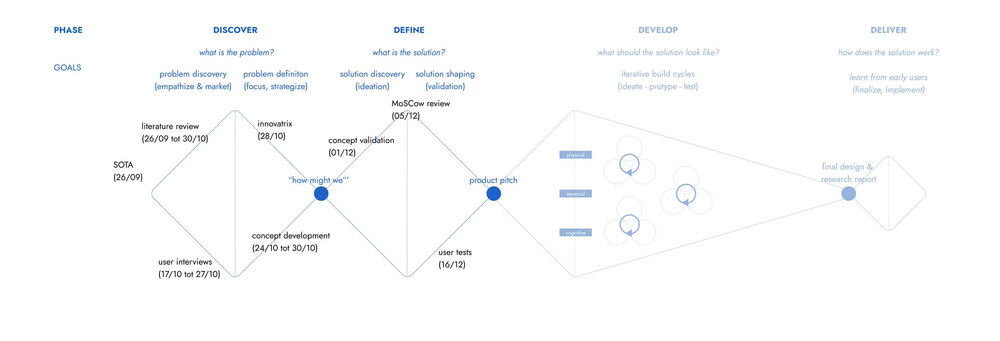

# FlowGuard
*De bureau-tool die helpt om een efficiënte en gezonde workflow te onderhouden.* 

*Projectteam: Daan Dobbelaere; Jasper Dekeyser*

23/09/2024 - 08/01/2025

## Samenvatting
Op de werkvloer van tegenwoordig is er te veel stress en werkdruk, hoewel ze vaak te vermijden zijn. Onnodige stress en werkdruk kan leiden tot mentale en onrechtstreeks fysieke zorgen en in extreme gevallen tot burn-outs. 

Uit meerdere literatuuronderzoeken en interviews met relevante participanten blijkt dat dit grotendeels ligt aan het feit dat men tegenwoordig constant bereikbaar is via de gsm en computer, maar ook dat er niet genoeg rekening gehouden wordt met elkaar. Dit laatste is vaak een gevolg van slechte communicatie of gaat over zaken die moeilijk te communiceren zijn, zoals stress.

In het zoeken naar een oplossing werden naast de literatuuronderoeken en interviews ook andere ontwerpmethodes gebruikt om de diepe oorzaken te zoeken en tot een concrete oplossing te komen.

De oplossing dat in dit dossier wordt voorgesteld is een product dat helpt om een gezonde balans te houden tussen werken en pauzes, en deze pauzes op fysisch niveau kan helpen verbeteren. Daarnaast kan het zorgen voor complete focus, zonder afleiding van de omgeving. Dit door het wegfilteren van onnodige meldingen en onnodige onderbrekingen door collega’s.
Het product geeft een gevoel van voldoening  die men tegenwoordig zoekt op een werkdag. 

## Introductie
Volgens Riziv (Rijksinstituut voor ziekte- en invaliditeitsverzekering) zijn 36,44% van de mensen in invaliditeit op 31 december 2021 arbeidsongeschikt door een psychische stoornissen en 66,39% daarvan door een depressie of een burn-out. De werkdruk en stress tijdens de job spelen hier een grote rol in, maar ook de constante bereikbaarheid via mail, berichten, sociale media, op de werkvloer, etc. zorgen voor een daling in werkefficiëntie met als gevolg een stijging in stress en werkdruk. Stress en werkdruk die te vermijden zijn…

Eerder dit jaar werd gekozen tussen verschillende design-challenges en hieruit kwam deze challenge voort, namelijk stress, werkdruk en pauzes verbeteren bij werknemers die dagelijks aan een bureau werken in een kantooromgeving. Het is de bedoeling dat ons product deze problemen oplossen door regelmatig pauzes aan te raden, de werkstatus te communiceren met collega’s en voldoening het geleverde werk.

Dit is een alledaags probleem en komt voor bij meerdere doelgroepen, denk bijvoorbeeld aan studenten. Om dit probleem te begrenzen en de oplossing zo gebruiksgericht te kunnen ontwerpen, is eerst gekozen voor de doelgroep kantoormedewerkers die dagelijks het merendeel van de dag aan een bureau werken. Als een oplossing wordt gevonden voor deze doelgroep, kan verder gekeken worden naar andere doelgroepen met een gelijkaardig probleem.

Bronnen:
Langdurige arbeidsongeschiktheid: Hoeveel langdurige burn-outs en depressies? Hoeveel kost dat aan uitkeringen?  | RIZIV. (z.d.). https://www.riziv.fgov.be/nl/statistieken/statistieken-uitkeringen/langdurige-arbeidsongeschiktheid-hoeveel-langdurige-burn-outs-en-depressies-hoeveel-kost-dat-aan-uitkeringen#Een_toename_van_46%_van_langdurige_burn-outs_en_depressies_in%C2%A05%C2%A0jaar

## Methodologie
In dit project werd gebruik gemaakt van onderstaande ontwerpmethode, deze is gebaseerd op de "quadriple diamond".

Het eerste semester werden de Discover en Define fase doorlopen, oftewel de eerste "diamond". Er werd in discovery vooral gefocust op het onderzoeken van je probleem en het afbakenen van de doelgroep, waarna een concept kon worden gemaakt om het probleem en oplossingsmogelijkheid te pitchen. Toen het concept werd gekozen, is in de definition fase vooral gefocust op het concept valideren en kijken of alles van de discovery goed is geanalyseerd.

## Discovery (N = 15)

### Doelstellingen
De doelstelling van de discoveryfase was vooral het probleem begrijpen en omvatten. De eerste manier om dit doel te bereiken was om van het probleem, namelijk stress en werkdruk, terug te bouwen naar de oorzaak. Een tweede methode was om de omvang van het probleem te begrijpen en kijken hoe dit probleem kan worden vastgesteld.
### Materiaal & methoden
 #### SOTA-schema (zie bijlagen)
 Alvorens methoden en doelstellingen werden vastgelegd, werd eerst gekeken wat men persoonlijk wist van dit probleem.
 #### User interview (N = 3)
 In dit onderzoek werd teruggegaan naar de oorzaak van de stress en werkdruk bij verschillende personen. Omdat iedereen dit anders kan ervaren en hier een dieper inzicht nodig was werd geopteerd voor een user interview.
 De interviews werden uitgevoerd en samengevat aan de hand van een protocol en rapport (zie bijlagen) 
 #### Liturature review (N = 12)
 Hier werd gekeken naar de grootte en omvang van het probleem, hoe stress gemeten kan worden en in welke mate de kantooromgeving de fysieke en mentale gezondheid beïnvloedt.
 De liturature reviews werden uitgevoerd en samengevat aan de hand van een protocol en rapport (zie bijlagen) 

### Resultaten
De liturature review werd uitgevoerd doorheen de volledige discoveryfase en werd uitgevoerd aan de hand van een protocol en rapport (zie bijlage). De belangrijkste zaken die hieruit kunnen worden afgeleid zijn:
- **Methode om stress te meten**: Om de stress goedkoop, maar toch zo correct mogelijk te meten, zou er best gebruik gemaakt worden van hartslagmeting mogelijks gecombineerd met galvanische  huidrespons. De hartslagmeter kan zonder persoonlijke aanpassing toch een accuraat beeld van de stress weergeven. Het werkt namelijk op basis van hartslagvariabiliteit en niet op de hartslagwaarde zelf, zo zijn er geen problemen bij mensen die van nature een hoge hartslag.
- **Het probleem is groter dan gedacht**: Niet alleen in de kantooromgeving, maar ook bij veel andere jobs en zelfs studenten is dit probleem aanwezig. Dit zijn doelgroepen die met behulp van kleine aanpassingen aan het eindproduct hier misschien ook gebruik van kunnen maken. Om het product tot stand te brengen zal de doelgroep echter beperkt blijven tot kantoorjobs.
- **Weinig fysieke beweging**: Dit is niet het hoofdprobleem dat in dit proces onderzocht wordt of behandeld, maar kan een oorzaak zijn van stress in de context van het gekozen probleem en wordt verder onderzocht in de user interviews.
- **Stress en werkdruk**: Meerdere zaken spelen een rol, namelijk de omgeving, kwaliteit van werken, organisatie, werkhoeveelheid, ... of deze allemaal van toepassing zijn zal ook nader onderzocht worden in de user interviews.
- **Sociale media en technologie**: Dit speelt grote parten in de stress en werkdruk. De afleiding is te groot en heeft een negatief effect op de productiviteit, stress, werkdruk en de mentale gezondheid.
> “Ons brein is nog altijd niet goed bestand tegen Whatsapp, e-mail en Zoom.”

Bij de user interviews werden een 3-tal respondenten ondervraagt en werden de overgebleven onduidelijkheden in de liturature review onderzocht. Volgende zaken kwamen meerdere malen naar voor:
- **Moeilijkheid om lange tijd aan een stuk te concentreren**: Alle respondenten zijn het eens over het feit dat er tegenwoordeig meer afleidingen zijn. Dit door meldingen van gsm's maar ook door collega's die storen, of andere afleidende zaken.
- **Te weinig voldoening halen uit je job**: Hoewel dit niet van toepassing was bij de respondenten gaven ze aan dat dit een grote oorzaak is van stress en burn-outs.
- **Communicatie**: Hierbij worden vaak problemen ondervonden die onnodig zijn. Dit kan gaan van frustraties die je niet kan uiten tot persoonlijke zaken waarbij je je niet comfortabel voelt om ze te delen of aarzelingen om hulp te vragen.
- **Fysieke beweging**: Dit werd niet zozeer gemist, omdat men dit makkelijk inhaald buiten het werk. Dit mag dus geschrapt worden als oorzaak van stress.
- **Pauzes**: Hier is zeker ruimte voor verbetering. Ze worden vaak vergeten, niet genoeg gesimuleerd en dit geeft een kans om even weg te zijn van je stresserende omgeving.

### Conclusies & implicaties
De grootste problemen op de moderne werkvloer zijn de communicatie, afleiding, gebrek aan voldoening en weinig initiatief tot pauzes. Het feit dat men vandaag de dag constant bereikbaar moet zijn, zorgt voor constante onderbreking tijdens het werken. Deze nieuwe vormen van communicatie zorgen ook dat er minder vlotte en duidelijke communciatie is tussen collega's, waardoor kleine problemen ontstaan die uitgroeien tot grotere, vermijdbare problemen. Hieruit volgt dat het product moet kunnen communiceren en empathie opwekken. Dit is belangrijk voor de groepsfeer en de werkefficiëntie. Het onderdeel werkefficiëntie is zeker een hoofdzaak en staat verbonden met de andere deelproblemen: het product moet kunnen aangeven wanneer iemand geconcentreerd en gefocust bezig is om onnodige afleiding te beperken of zelfs vermijden. Hierdoor is meer werk gedaan en zal de werkdruk en thuiswerk verminderen. Een ander belangrijk aspect is de stress, aangezien dit moeilijk te zien is en moeilijk valt te communiceren. Er is nood aan stressmeting en stressreductie, mogelijks door pauzes of andere rustmomenten.
 
Een extra toevoeging zou kunnen zijn om te zorgen dat de gebruiker meer voldoening heeft na een werkdag. Dit gepaard met aansporing tot meer fysieke beweging en de eerder vermelde zaken zou het product veel mogelijkheden bieden om de werkvloer aangenamer en minder stressvol te  maken.
 
<ins> Om deze zaken duidelijker te kaderen en te verwoorden in requirements, werd een innovatrix ingevuld (bijlagen)

> [!IMPORTANT]
> Design Requirements:
> - D1.1 Het product moet pauzes aanraden
> - D1.2 Er moet tijdens pauzes beweging aangeraden worden
> - D1.3 Het product moet tijdens het werken onnodige meldingen wegfilteren
> - D1.4 Werktijd en pauzetijd moeten duidelijk gescheiden worden
> - D2.1 Werkstatus moet onderling gedeeld kunnen worden
> - D2.2 Een focusstand moet gebruiker ongestoorde focus en rust bieden
> - D2.3 Focus moet gerespecteerd worden door collega's (empathie opwekken)
> - D2.4 Stress moet gemeten en gecommuniceerd worden
> - D3.1 Gebruiker voldoening hebben aan einde van de dag
> - D4.1 Stress wordt gemeten a.d.h.v. hartslagvariabiliteit 

Hierna kon een correct en innovatief eerste concept opgesteld worden.

## Definition

Na de goedgekeuring van dit concept werd gefocust op definiëren van het concept en een beter beeld te krijgen van de uiteindelijke vereisten van het product. Dit werd gedaan aan de hand van twee testing waves uitgevoerd door telkens vijf testpersonen uit de doelgroep. 

Uit de discovery kunnen de belangrijkste aspecten van de oplossing gebundeld worden:
1. Werkefficiëntie verhogen
2. Onderlinge communicatie verbeteren
(3. Pauze en voldoening)

Om beter te kunnen bekijken waar er nog onduidelijkheden zijn werd eerst een storyboard uitgewerkt met als onderwerp het eerste concept van wave 1 en deze werd dan ook geanalyseerd.

### <ins>Wave 1: conceptvalidatie</ins> (N=5)

#### Doelstellingen
Het doel van deze conceptvalidatie is om het eerste concept met een paar mockups voor te stellen aan de doelgroep en hun meningen, inzichten en onduidelijkheden te capteren. Op deze manier kan gekeken worden of dit concept aan de eisen van de doelgroep voldoet.
#### Materiaal & methoden
Testpersonen maken kennis met het concept en er worden enkele open, maar gerichte vragen gesteld. Voor een gedetailleerd stappenplan kan worden gekeken naar het protocol (bijlagen). 
Benodigdheden zijn:
- een laptop om de antwoorden te capteren
- dyctafoon voor spraakopname
- 2 quick-and-dirty prototypes gemaakt om mee te interageren
 **De prototypes dienen dus vooral om het concept te communiceren met de doelgroep op visueel vlak**.

#### Resultaten
**Stress**: Stress wordt door iedereen ervaren als een onvermijdelijk deel van het werk, waarbij een duidelijke scheiding tussen werk en privé essentieel is om een gezonde balans te behouden.

**Fysieke beweging**: Over beweging tijdens het werk verschillen de meningen: sommigen vinden dat er meer moet worden bewogen of rechtgestaan, maar een kleine meerderheid vindt dat niet nodig tijdens de werkuren. Hieruit kunnen we besluiten dat D 1.2 kan worden weggelaten.

**Pauzes**: Het idee van pauzes <ins> op basis van tijd </ins> wordt door iedereen als vanzelfsprekend gezien. Het zelf kunnen instellen van werk- en pauzelengtes is een must en sommigen opteren voor een optie om je pauze nog net iets uit te stellen, indien je net nog niet klaar was met een taak. 
Er werd door iemand voorgesteld om pauzes synchroon te laten verlopen met andere collega's tijdens teamactiviteiten, zoals vergaderingen of telefoongesprekken, om efficiënter te werken als een team. Pauzes <ins> op basis van stressmetingen </ins> wordt door de meesten positief ontvangen en de meesten zijn dan ook bereid om daarvoor externe apparatuur te dragen. 2 participanten waren hier minder fan van en stelde voor om het als een optie aan te bieden. 

**Meldingen**: Indien technologisch mogelijk, zouden sommigen het wenselijk vinden om meldingen van je gsm te syncroniseren met het product en niet-essentiële meldingen weg te filteren.

**Vormgeving**: Het product wordt meerdere malen geassociëerd met een eierklokje, alleen wordt het niet gewenst dat het voortdurend gaat tikken tijdens het aftellen. Het product was groot genoeg om op te vallen. Indien er symbolen of woorden gebruikt worden, zou de betekenis zeer duidelijk moeten zijn en liefst in het Nederlands.

**Communicatie**: De participanten benadrukken de respect voor de rust van collega’s en bevestigen de bijdrage dat het product kan leveren op vlak van communicatie. Live-updates over stress worden minder op prijs gesteld, omdat deze mogelijk meer afleiden dan bijdragen.

**Dagelijkse evaluatie**: De evaluatie van werkprestaties en stressniveaus wordt door de meeste deelnemers gewaardeerd. Dit helpt hen reflecteren op hun werkdag en geeft inzicht in hun productiviteit. Een enkeling uitte echter zorgen dat dit juist zal zorgen voor ontenvredenheid.

Vrijwel iedereen benadrukte het belang van **persoonlijke aanpassingsmogelijkheden**. Dat ging over voor werk- en pauzeduur, syncronisatie en filtering van meldingen, het meten van stress door externe apparatuur en de soorten analyses op het einde van de dag. Ook mocht alles niet te lang duren om in te stellen om het gebruiksgemak en de werkefficiëntie hoog te houden.

#### Conclusies & implicaties
Het concept is zeer gewild binnen de doelgroep, maar er moeten met enkele zaken rekening gehouden worden. Het product moet een ****intuïtieve instelling**** van werk- en pauzetijden bieden, met de mogelijkheid om pauzes uit te stellen of synchroon in te plannen met collega's. **Stressmetingen** kunnen als optionele functie worden geïntegreerd om melding te doen aan de gebruiker of pauzes te vervroegen. Indien mogelijk moeten storende **meldingen gefilterd** worden tijdens focusstand. Wat betreft de vormgeving moet het product **herkenbaar en opvallend** zijn, met duidelijke symbolen en tekst in het Nederlands. Een visuele indicator voor **focusstatus** moet aanwezig zijn, liefst een **kleurlicht**. Ten slotte moeten gebruikers instellingen kunnen **personaliseren**, want iedereen werkt op een andere manier.
#### MoSCow review

### <ins>Wave 2: vorm van communicatie</ins> (N=5)

#### Doelstellingen
Het product zal in staat moeten zijn om duidelijk te communiceren. Bij het gebruik van het product zullen er twee vormen van communicatie voorkomen: het aanraden van pauzes naar de gebruiker toe (product – gebruiker) en het communiceren van de werkstatus met collega's (product – collega's). Met volgende testen wordt gekeken welke signalen het best gebruikt worden.
#### Materiaal & methoden
Er wordt geopteerd om de testen uit te voeren in de juiste context, dus worden deze uitgevoerd bij 5 participanten in een vooraf gecontacteerd kantoor. Een gedetailleerd stappenplan voor de twee uit te voeren testen is te vinden in het protocol van Wave 2 (bijlagen). 
Volgende zaken zijn nodig:
- een laptop met een typtest
- een prototype dat kan lichtgeven, geluid maken en trillen
- een smartwatch dat kan trillen
- een laptop om te noteren/context te simuleren
- gsm om interactie te capteren (filmen)
Het prototype is een doos gemaakt uit MDF en plexiglas met ruimte om een smartphone in te plaatsen en focust puur op de functie om signalen te kunnen verzenden en is niet bedoeld om het voorkomen van het product te representeren. 
Voor deze test wordt dus gekozen voor een **functioneel, ruw prototype** in de plaats van een esthetisch prototype.

#### Resultaten
##### <ins> Test 1 (product - gebruiker):

 
 
Deze tabel bevat de gemiddelde scores van alle participanten. Voor de scores per participant kan gekeken worden in het rapport van Wave 2.
 
 

|   | Gekleurd licht | Flikkerend licht | Geluid  | Trillen hub   | Trillen armband   |
| -------- | :---: | :---: | :---: | :---: | :---: |
|**Hoe hard valt het signaal op?** | 2.2 | 3.2 | 4.6 | 3.4 | 3.75 |
|**Hoe aangenaam is het signaal?** | 4.4 | 3.4 | 3.2 | 2.8 | 3 |
|**Hoe hard zet het signaal je aan tot actie?** | 2.8 | 3.2 | 4.2 | 2.6 | 3.5 |
|**Hoe snel leidt het signaal je af?** | 2.6 | 3.4 | 4.4 | 2.8 | 4 |
|**Hoe moeilijk is het signaal te negeren? (in het geval dat het eindeloos doorgaat)** | 2.2 | 3 | 4.6 | 3 | 4.5 |
|**Hoe afleidend is het signaal voor je collega’s en omgeving?** | 2.2 | 3 | 4.8 | 4.6 | 1.5 |

Uit het gemiddelde van de 5 testpersonen kunnen een aantal zaken afgeleid worden:
- **Gekleurd licht** is het aangenaamst en stoort de omgeving bijna niet, maar het valt het minst op en motiveert minder om actie te ondernemen.
- **Flikkerend licht** trekt iets meer aandacht en zet meer aan tot actie, maar wordt als minder aangenaam ervaren dan gekleurd licht.
- **Geluid** valt het meest op en zet het meest aan tot actie, maar het is zeer storend voor andere collega’s. Het geluid kan ook als het bel- of alarmsignaal van een gsm geïnterpreteerd worden, wat verwarrend kan zijn door alle gsm's aanwezig op een bureau.
- **Trillen via de hub** is redelijk opvallend en stoort de omgeving niet veel, maar het activeert het slechtst en wordt als het minst aangenaam ervaren. Dit komt waarschijnlijk door de associatie met het trillen van een gsm. Eén van de testpersonen had het trilsignaal zelfs niet opgemerkt omdat hij dacht dat het een gsm van de observators was.
- **Trillen via een armband** biedt een mooie balans: het trekt voldoende aandacht, motiveert goed tot actie en stoort collega's bijna niet. Het signaal is vrij lastig te negeren en op aangenaamheid scoort de armband maar middelmatig.

 > “Als stress op een andere manier wordt gemeld, waardoor je zeker weet dat je stress hebt, dan zal dit leiden tot meer stress”

##### <ins> Test 2 (product - collega's):

 
 
Deze tabel is een samenbundeling van de antwoorden van alle participanten. Voor de antwoorden per participant kan gekeken worden in het rapport van Wave 2.
 
 

|   | Groen  | Geel | Oranje  | Rood   | Blauw   | Wit  |
| -------- | --- | --- | --- | --- | --- | --- |
|**Welke emotie roept deze kleur op?** | - rust   - toegankelijk  - bereikbaar | - ruime inbreng, van oppassen voor stress tot feest | - tussen groen en rood   - vooral een gevoel van stress en opletten   - eerder aan de kant van rood | - opgelet! - stress!  - gevaar!  - focus! | - rust  - kalmte  - pauze   - minder streng kleur| - neutraal  - sfeerlamp |
|**Wat zou de reden zijn dat jouw collega deze kleur zou gebruiken?** | - bereikbaar  - rustige taak - mails checken  | - taken waarbij je liever niet gestoord wordt, maar het is geen groot probleem | - niet storen  - stressvolle taak - druk bezig |  - zeer gefocust werk   - niet storen anders ben ik de kluts kwijt | - pauze   - rustige taak | - geen opdracht   - misschien pauze |
|**Wat denk je dat hij/zij op dat moment aan het doen is?** | zie hierboven | zie hierboven | zie hierboven | zie hierboven | zie hierboven | zie hierboven |

**Rood en groen** brengen een éénduidige emotie op bij alle participanten. Dit zorgt ervoor dat deze makkelijk geïntegreerd kunnen worden in het concept zonder veel uitleg of moeilijkheden. Een aantal van de andere kleuren brengen oftwel zeer verschillende gevoelens naar boven oftewel zeer neutrale. Deze kunnen met enige duiding gebruikt worden in het product, zonder dat hierover verwarring ontstaat.
 **Blauw, wit en andere meer extrensieke kleuren**: Deze brengen verwarring en geven ze bij iedereen een ander gevoel. Dit kan misschien voor een specifieke functie/interactie gebruikt worden.
 **Oranje en geel**: Deze staan tussen rood en groen, maar geven ook geen eenduidig gevoel bij de participanten, waardoor ze moeilijker intuïtief te gebruiken zijn.
#### Conclusies & implicaties
Het <ins> communiceren van product naar werknemer </ins> moet eenduidig zijn en genoeg aandacht trekken naar de gebruiker toe. Anderzijds moet worden vermeden dat collega's hiermee worden gestoord. Het product zal dus gebruik maken van een **trillende armband** om met de gebruiker te communiceren. Omdat velen het trilsignaal toch niet zo aangenaam vonden, kan er misschien gewerkt worden naar een masserend trilpatroon. 

Bij de <ins> communicatie van het product naar de collega's </ins> wordt gezocht naar kleuren die bij de meeste participanten hetzelfde gevoel oproepen of kleuren waar nog een inbreng aan kan worden gegeven. In het algemeen volstaat **groen en rood** om duidelijk aan te geven of je beschikbaar bent of niet. Te veel onderverdelingen van deze kleuren zoals geel of oranje zijn minder gewenst. Kleuren zoals blauw en wit staan open voor interpretatie en kunnen eventueel nog een betekenis geven aan zijfuncties van het product.

> [!IMPORTANT]
> Design Requirements:
> - D1.2 ~~Er moet tijdens pauzes beweging aangeraden worden~~ 
> - D2.5 De stressmeting moet kunnen uitgeschakeld worden indien gewenst
> - D2.6 De focusstand van de gebruiker wordt gecommuniceerd met een visuele indicator, namelijk kleur
> - D2.7 Buitenstaanders mogen niet worden gestoord door communicatie van het product als het niet aan hen is gericht
> - D2.8 Communiceren van product naar gebruiker gebeurt met een trillend, masserend patroon op de pols
> - D2.9 Om de focusstand te communiceren worden de kleuren groen en rood gebruikt
> - D4.2 Het product is snel en intuïtief in te stellen
> - D4.3 Het product kan op elk moment opnieuw worden ingesteld of de instellingen worden aangepast
> - D4.4 Het voorkomen van het product is opvallend en zichtbaar om aandacht op zich te kunnen brengen
> - D4.5 Tekst op het product dient in het Nederlands te zijn

## Define
### Define 1
#### Doelstellingen
Om de volgende stappen in het proces makkelijker te maken het product meer de definiëren is nood aan een interace. Deze zal het fysieke aspect van het product bepalen en de integratie van electronica meer geordend maken. In deze test zal gekeken worden waar de interacties zich bevinden op de centrale interface samen met de indeling van de website die bij het product hoort. 

#### Materiaal & methoden
Om deze test te realiseren wordt gebruik gemaakt van een interactief, 'think aloud' interview om de indeling van de interface te bepalen en een interactief website-prototype op figma om deze layout te onderzoeken en te beoordelen. Om de 4 participanten zoveel mogelijk vrijheid te geven en de indeling van de interface worden geen voorgemaakte interfaces aangeboden maar lege foam-modellen waarop ze zelf de knoppen kunnen ordenen. De gebruikte zaken zijn:
- Simpele schuimvormen (balk en cilinder)
- Interacties in de vorm van knoppen per functie (tijd instellen, start/pauze, aan/uit, groen/rood)
- Smartphone om conversaties op te nemen
- 4 afgeprinte informed consents
- Laptop om protocol voor te lezen en resultaten te noteren
- Laptop om voorbeelden van de centrale interface te tonen en website te simuleren

De voorgemaakte layout's voor de website zien er uit als volgt:

Deze kunnen worden getest met volgende link: [prototype websites](https://www.figma.com/design/WJBzaDU9i3cPEKHMzfiFzu/websites?node-id=0-1&m=dev&t=i1vy643DXOuWa7JA-1)
Naast de layout van de website wordt ook specifiek de functie in verband met synchroniseren van pauzes op de website getest.

 
Om de beste layout er uit te halen wordt aan de participanten gevraagd om websites van beste tot minst goed te ranken. Verder wordt gekeken naar moeilijkheden bij het gebruik van de websites door live mee te kijken, maar ook door schermopnames te maken en dezeze achteraf te analyseren.

#### Resultaten
##### <ins> Centrale interface </ins>
- **Vorm:** Cilinder heeft meest vriendelijke en organische uitstraling en het minst robuust.
- **Knop tijd instellen:** Draaiknop heeft de voorkeur doordat het mooi in de centrale vorm geïntegreerd kan worden en zeer intuïtief werkt.
- **Knop aan/uit:** Drukknop wint omdat zijn kleine omvang het minst opvalt. Er moet wel duidelijke feedback zijn in welke staat het zich bevindt. Het mag zich op een minder toegankelijke plek bevinden, aangezien het niet vaak gebruikt zal worden.
- **Knop starten/stoppen:** Enkele drukknop die zich vanboven op toestel bevindt is het best voor gemakkelijke en snelle toegankelijkheid. Het indrukken van deze knop geeft een duidelijk gevoel van de start van een werkperiode. Duidelijkheid over huidige staat van knop is zeer belangrijk, dus daar moet rekening mee gehouden worden.
- **Knop groen/rood:** Twee drukknoppen moeten vrij groot zijn om makkelijk te bedienen, liefst ook op een toegankelijke plaats. De kleurlichten moeten duidelijk zijn en een groot oppervlak bedekken, maar mogen niet te fel zijn. De lichten moeten ook zichtbaar zijn als bureaus visueel van elkaar gescheiden worden. Ook hierbij is de staat van de knop zeer belangrijk, maar die wordt al rap duidelijk door de kleur van het licht.

Volgende interfaces werden ontworpen tijdens het interactief ontwerpen:

##### <ins> Webiste interface </ins>
<ins> lay-out </ins>
- Website 1 is goed door het strak design, maar slechter doordat er meer clicks nodig zijn.
- Website 2 en 3 worden als gelijkaardig beschouwd en zijn goed doordat de functies duidelijk zijn weergegeven. De voorkeur ging toch naar website 3.
- Website 4 is goed doordat visueel duidelijk is wat er achter de knoppen zit.

Er werd ook gevraagd naar een rangschikking van beste naar slechtste lay-out:

| participant | lay-out 1 | lay-out 2 | lay-out 3 | lay-out 4 |
|------|---|---|---|---|
| **1** | 1 | 2 | 3 | 0 |
| **2** | 1 | 3 | 2 | 0 |
| **3** | 3 | 0 | 1 | 2 |
| **4** | 0 | 1 | 2 | 3 |
| **TOTAAL** | 5 | 6 | 8 | 5 |

<ins> tablad werkomgeving </ins>
Bij het testen van de interacties op de website werden snel enkele zaken duidelijk. Om alle opmerkingen te zien of enkele schermopnamen kan gekeken worden naar het rapport van deelopdracht 3 (bijlagen). De belangrijkste zaken zijn:
- **Tutorial**: Na de website even te proberen en enkele fouten te hebben gemaakt was iedereen ervan overtuigd dat ze deze niet meer opnieuw zouden maken. Een tutorial of korte uitleg over de werking zou dus helpen.
- **Tijdsaanduiding**: Er moet duidelijker getoond worden als het over uren of minuten gaat. Om dit te duiden met een voorbeeld: de meesten dachten dat 01:20 een timer was voor een minuut en 20 seconden, waar een uur werd bedoeld.
Ook moet duidelijker getoond worden dat dit een aflopende timer is dat overgaat in een pauze wanneer deze eindigt.
- **Licht uit**: Men was niet zeker wat de betekenis was van een licht dat niet aan stond.

> Krijg je een melding als iemand met jouw timer synchroniseert?

#### Conclusies & implicaties
Centrale interface:
Iedereen streeft naar een zo intuïtief mogelijk en esthetisch zo strak mogelijk ontwerp. Knoppen worden het liefst bijna blindelings en met één hand gebruikt. Indien mogelijk worden zo weinig mogelijk knoppen geprefereerd. Knoppen moeten tamelijk gegroepeerd zijn, zodat je er niet achter moet zoeken. Knoppen die vaker gebruikt worden, moeten groter zijn dan knoppen die minder vaak gebruikt worden. Ten slotte moeten knoppen duidelijke feedback geven en er mag geen twijfel zijn over de huidige staat van een product.

Tabblad Werkomgeving:
- Er moet een duidelijk onderscheid zijn tussen de timer en de werkstatus.
- Tijdsaanduiding mag niet verwarrend zijn.
- Bij eerste gebruik van de website moet er een kleine introductie zijn om duidelijkheid te scheppen.
- Synchroniseren gebeurt intuïtiever door eerst op naam te klikken en vervolgens op “synchroniseer” of door één grote “synchroniseer”-knop te voorzien en vervolgens op een naam.

> [!IMPORTANT]
> Design Requirements:
> - D1.2 ~~Er moet tijdens pauzes beweging aangeraden worden~~ 
> - D2.5 De stressmeting moet kunnen uitgeschakeld worden indien gewenst
> - D2.6 De focusstand van de gebruiker wordt gecommuniceerd met een visuele indicator, namelijk kleur
> - D2.7 Buitenstaanders mogen niet worden gestoord door communicatie van het product als het niet aan hen is gericht
> - D2.8 Communiceren van product naar gebruiker gebeurt met een trillend, masserend patroon op de pols
> - D2.9 Om de focusstand te communiceren worden de kleuren groen en rood gebruikt
> - D4.2 Het product is snel en intuïtief in te stellen
> - D4.3 Het product kan op elk moment opnieuw worden ingesteld of de instellingen worden aangepast
> - D4.4 Het voorkomen van het product is opvallend en zichtbaar om aandacht op zich te kunnen brengen
> - D4.5 Tekst op het product dient in het Nederlands te zijn

## Overzicht Requirements

|ID| Design Requirement | Bron | Datum |
| -------- | :--- | :---: | :---: |
|*Groep 1* | *Werkefficiëntie* |  |  |
| 1.1 | Er moeten pauzes aangeraden worden | user interviews | 17/10/2024 |
| 1.3 | Onnodige meldingen moeten weggefilterd worden | user interviews | 27/10/2024 |
| 1.4 | Werktijd en pauzetijd moeten duidelijk gescheiden worden | user interviews | 27/10/2024 |
|*Groep 2* | *Communicatie* |  |  |
| 2.1 | Werkstatus moet onderling gedeeld kunnen worden | Definition (wave 1) | 01/12/2024 |
| 2.2 | Een focusstand moet gebruiker ongestoorde rust bieden | user interviews | 27/10/2024 |
| 2.3 | Focus moet gerespecteerd worden door collega's (empathie opwekken) | Definition (wave 1) | 01/12/2024 |
| 2.4 | Stress moet gemeten en gecommuniceerd worden | user interviews | 24/10/2024 |
| 2.5 | De stressmeting moet kunnen uitgeschakeld worden indien gewenst | Definition (wave 1) | 01/12/2024 |
| 2.6 | De focusstand van de gebruiker wordt gecommuniceerd met een visuele indicator, namelijk kleur | Definition (wave 1) | 01/12/2024 |
| 2.7 | Buitenstaanders mogen niet worden gestoord door communicatie van het product als het niet aan hen is gericht | Definition (wave 2) | 16/12/2024 |
| 2.8 | Communiceren van product naar gebruiker gebeurt met een trillend, masserend patroon op de pols | Definition (wave 2) | 16/12/2024 |
| 2.9 | Om de focusstand te communiceren worden de kleuren groen en rood gebruikt | Definition (wave 2) | 16/12/2024 |
|*Groep 3* | *Voldoening* |  |  |
| 3.1 | Gebruiker moet voldoening hebben aan einde van de dag |  | 24/10/2024 |
|*Groep 4* | *Algemeen* |  |  |
| 4.1 | Stress wordt gemeten a.d.h.v. hartslagvariabiliteit  | liturature review | 01/12/2024 |
| 4.2 | Het product is snel en intuïtief in te stellen | Definition (wave 1) | 30/10/2024 |
| 4.3 | Het product kan op elk moment opnieuw worden ingesteld of de instellingen worden aangepast | Definition (wave 1) | 01/12/2024 |
| 4.4 | Het voorkomen van het product is opvallend en zichtbaar om aandacht op zich te kunnen brengen | Definition (wave 1) | 01/12/2024 |
| 4.5 | Tekst op het product dient in het Nederlands te zijn| Definition (wave 1) | 01/12/2024 |

## Bill of materials
- Arduino of andere makkelijk te programmeren tools om juist kleur licht te schijnen op het juiste moment.
- elektronica voor het maken van een klok/timer
- vormen om de esthetische kant te testen en de omvang (zelf te maken)
- stressmeter (werkend met hartslagvariabiliteit)
  --> idealiter te verbinden met de centrale interface om kleur te verkrijgen
- vibratiemotor waarvan frequentie en intensiteit geregeld kan worden
  
## Kritische reflectie
In het algemeen zit het project op schema. Bij de eerste stappen was er moeite met het afbakenen de essentie en zag men soms door het bos de bomen niet meer. Door de conceptvalidatie kreeg het project echter validatie en feedback wat zorgde voor meer richting. Bij elke stap kwam er meer duidelijkheid en structuur. Er werden signalen gegeven vanuit de doelgroep die aantoonden dat er een probleem is waar nog geen concrete oplossing voor is en waarvan de oplossing zeer gewild is. Het was rap duidelijk dat de doelgroep de leidraad is en hun feedback dit project vooruit zal helpen. Er werd heel veel input via de interviews en gebruikerstesten verkregen, maar het was niet altijd even simpel om met alles rekening te houden en deze zaken correct te analyseren. Dit kwam vooral omdat sommige antwoorden volledig verschilden met anderen. Daarom wordt belang gehecht aan de mogelijkheid om het product te personaliseren voor elke gebruiker, zonder de complexiteit te verhogen. De grootste uitdagingen die nu volgen zijn het prototypen en realiseren van de vorm en elektronica van het product en tevens evenveel belang hechten aan de feedback van de doelgroep als in de eerste fasen.
## Bronnen
•	Nws, V. (2021, 17 mei). Aantal langdurige burn-outs en depressies blijft stijgen tot meer dan 100.000: “Ons brein kent geen rust meer”. vrtnws.be.      https://www.vrt.be/vrtnws/nl/2021/05/17/aantal-burn-outs-en-depressies-blijft-stijgen/ 
•	Langdurige arbeidsongeschiktheid: Hoeveel langdurige burn-outs en depressies? Hoeveel kost dat aan uitkeringen?  | RIZIV. (z.d.). https://www.riziv.fgov.be/nl/statistieken/statistieken-uitkeringen/langdurige-arbeidsongeschiktheid-hoeveel-langdurige-burn-outs-en-depressies-hoeveel-kost-dat-aan-uitkeringen#Een_toename_van_46%_van_langdurige_burn-outs_en_depressies_in%C2%A05%C2%A0jaar 
•	 S. Samima, M. Sarma and D. Samanta, "Detecting vigilance in people performing continual monitoring task", Proc. Int. Conf. Intell. Human Comput. Interact., pp. 202-214, 2017. 
•	Attention and Concentration for Software Developers. (2023). IEEE Journals & Magazine | IEEE Xplore. https://ieeexplore.ieee.org/document/10232991 
•	Biswas, A., Oh, P., Faulkner, G., Bajaj, R., Silver, M., Mitchell, M., & Alter, D. (2015). Sedentary Time and Its Association With Risk for Disease Incidence, Mortality, and Hospitalization in Adults. Annals of Internal Medicine, 162, 123-132. https://doi.org/10.7326/M14-1651. 
•	Garber, C., Blissmer, B., Deschenes, M., Franklin, B., LaMonte, M., Lee, I., Nieman, D., & Swain, D. (2011). American College of Sports Medicine position stand. Quantity and quality of exercise for developing and maintaining cardiorespiratory, musculoskeletal, and neuromotor fitness in apparently healthy adults: guidance for prescribing exercise.. Medicine and science in sports and exercise, 43 7, 1334-59 . https://doi.org/10.1249/MSS.0b013e318213fefb. 
•	Tudor-Locke, C., Craig, C., Brown, W., Clemes, S., Cocker, K., Giles-Corti, B., Hatano, Y., Inoue, S., Matsudo, S., Mutrie, N., Oppert, J., Rowe, D., Schmidt, M., Schofield, G., Spence, J., Teixeira, P., Tully, M., & Blair, S. (2011). How many steps/day are enough? for adults. The International Journal of Behavioral Nutrition and Physical Activity, 8, 79 - 79. https://doi.org/10.1186/1479-5868-8-79. 
•	Tudor-Locke, C., Craig, C., Aoyagi, Y., Bell, R., Croteau, K., Bourdeaudhuij, I., Ewald, B., Gardner, A., Hatano, Y., Lutes, L., Matsudo, S., Ramírez-Marrero, F., Rogers, L., Rowe, D., Schmidt, M., Tully, M., & Blair, S. (2011). How many steps/day are enough? For older adults and special populations. The International Journal of Behavioral Nutrition and Physical Activity, 8, 80 - 80. https://doi.org/10.1186/1479-5868-8-80. 
•	Haskell, W., Lee, I., Pate, R., Powell, K., Blair, S., Franklin, B., Macera, C., Heath, G., Thompson, P., & Bauman, A. (2007). Physical activity and public health: updated recommendation for adults from the American College of Sports Medicine and the American Heart Association.. Circulation, 116 9, 1081-93 . https://doi.org/10.1161/CIRCULATIONAHA.107.185649. 
•	Haskell, W., Lee, I., Pate, R., Powell, K., Blair, S., Franklin, B., Macera, C., Heath, G., Thompson, P., & Bauman, A. (2007). Physical activity and public health: updated recommendation for adults from the American College of Sports Medicine and the American Heart Association.. Medicine and science in sports and exercise, 39 8, 1423-34 . https://doi.org/10.1249/mss.0b013e3180616b27. 
•	Garber, C., Blissmer, B., Deschenes, M., Franklin, B., LaMonte, M., Lee, I., Nieman, D., & Swain, D. (2011). American College of Sports Medicine position stand. Quantity and quality of exercise for developing and maintaining cardiorespiratory, musculoskeletal, and neuromotor fitness in apparently healthy adults: guidance for prescribing exercise.. Medicine and science in sports and exercise, 43 7, 1334-59 . https://doi.org/10.1249/MSS.0b013e318213fefb. 
•	Bolliger, L., Lukan, J., Colman, E., Boersma, L., Luštrek, M., Bacquer, D., & Clays, E. (2022). Sources of Occupational Stress among Office Workers—A Focus Group Study. International Journal of Environmental Research and Public Health, 19. https://doi.org/10.3390/ijerph19031075. 

## Bijlagen
### Discovery
#### sota
[probleem begrijpen](https://ugentbe-my.sharepoint.com/:w:/g/personal/daan_dobbelaere_ugent_be/EYZiQVYa3X1GpeBhcyGcWEcBCuQ2lsjSfwrgRcfts3pVXg?e=htsKas) 
#### interview:
 - [protocol literature review](https://ugentbe-my.sharepoint.com/:w:/g/personal/daan_dobbelaere_ugent_be/EYpVumC9AlxBmpwN7W_w8noBH8tK7tr-haeAGWDRJd8HZw?e=Flreca)
 - [rapport liturature review](https://ugentbe-my.sharepoint.com/:w:/g/personal/daan_dobbelaere_ugent_be/EYjzPVNM5MlDtGjL6JG0BmEBA4-ypAOcKbPFT_Lwt5zPCQ?e=Kymsm6)
#### literature review:
 - [protocol user interview](https://ugentbe-my.sharepoint.com/:w:/g/personal/daan_dobbelaere_ugent_be/EVttx7hZB4NGqJ2PyaAd68YBLmTs2JdSK9g-d2r60UxG-A?e=s8rgYk)
 - [rapport user interviews](https://ugentbe-my.sharepoint.com/:w:/g/personal/daan_dobbelaere_ugent_be/EZvQVpeR4VxAmggA3FAxTc0B6XfqyNkIsUj1BHddXhz0ng?e=vbvpyg)
#### inovatrix
[innovatrix discovery](https://ugentbe-my.sharepoint.com/:w:/g/personal/daan_dobbelaere_ugent_be/ETVq83qsM1RGu6nbJd2OT-ABc87Mdt7JGQi-2IB-lqhOzg?e=SkpB7p)
### Definition
#### wave 1
- [Wave 1 - protocol](https://ugentbe-my.sharepoint.com/:w:/g/personal/jasper_dekeyser_ugent_be/EYZHktuN6tFPi1oRMK0JxQwBntFvwxELfS6gzhyvpQ0wDw?e=xnT6e5)
- [Wave 1 - rapport](https://ugentbe-my.sharepoint.com/:w:/g/personal/jasper_dekeyser_ugent_be/EcPC2BOr4uxJpqWIRvKC0M4BQ8RbzJkPKD4grVZVPXoH9Q?e=gx1EWL)
#### wave 2
- [Wave 2 - protocol](https://ugentbe-my.sharepoint.com/:w:/g/personal/jasper_dekeyser_ugent_be/ESFLEPYkUs5Mu0Bn32X77uUBLm22u--p32820eaFBhQU7g?e=gaSdDT)
- [Wave 2 - rapport](https://ugentbe-my.sharepoint.com/:w:/g/personal/jasper_dekeyser_ugent_be/EfGzS8FE1ONKkOFaDqWbGA0BpjgTuPXQ3o3FHSvaMkoTlA?e=zEjI0B)
### Develop
#### Develop 1
- [Deelopdracht 3 - protocol](https://ugentbe-my.sharepoint.com/:w:/g/personal/daan_dobbelaere_ugent_be/EYFXz3Ox31dMjIWU9mxE6FgBZwoSi5SSflYKvu9Z5Soqaw?e=1DOxIu)
- [Deelopdracht 3 - rapport](https://ugentbe-my.sharepoint.com/:w:/g/personal/daan_dobbelaere_ugent_be/EZbGh_ffTqxMmQQITb3nka4BTq4fyeaXO81AsjtJjxOQ7g?e=cvizVJ)
#### Develop 2
-
-
#### Develop 3
-
-
